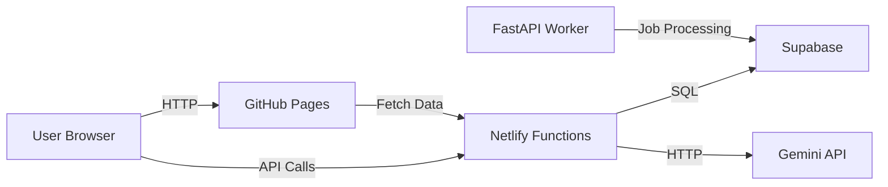

# 📘 مستندات جامع پلتفرم wesh360.ir

**نسخه:** 1.0.0
**تاریخ:** ۱۴۰۳/۱۱/۱۶
**پروژه:** zero-day-of-water2
**وبسایت:** https://wesh360.ir

---

## 📑 فهرست مطالب

1. [معرفی کلی](#معرفی-کلی)
2. [معماری سیستم](#معماری-سیستم)
3. [پشته فناوری](#پشته-فناوری)
4. [ویژگی‌های کلیدی](#ویژگی‌های-کلیدی)
5. [ساختار پروژه](#ساختار-پروژه)
6. [مشکلات و چالش‌های فعلی](#مشکلات-و-چالش‌های-فعلی)
7. [بهینه‌سازی‌های انجام شده](#بهینه‌سازی‌های-انجام-شده)
8. [راهنمای توسعه](#راهنمای-توسعه)
9. [مستندات API](#مستندات-api)
10. [پایگاه داده](#پایگاه-داده)
11. [امنیت و محدودیت‌ها](#امنیت-و-محدودیت‌ها)
12. [نقشه راه آینده](#نقشه-راه-آینده)

---

## 🎯 معرفی کلی

### درباره پروژه

پلتفرم **wesh360.ir** یک سیستم جامع تحلیل و شبیه‌سازی منابع آب و انرژی برای استان خراسان رضوی است که امکانات زیر را فراهم می‌کند:

- 📊 **تحلیل و مدل‌سازی بهره‌وری آب** با استفاده از Causal Loop Diagrams (CLD)
- 🗺️ **نقشه تعاملی آمایش انرژی** با نمایش سایت‌های خورشیدی، بادی و سدها
- ⚡ **محاسبه‌گر هزینه‌های آب و برق** با تعرفه‌های واقعی
- 🤖 **تحلیل هوشمند با AI** (Google Gemini)
- 📈 **داشبوردهای تعاملی** برای آب، برق، گاز و نفت

### اهداف کلیدی

1. **سادگی دسترسی**: ارائه اطلاعات پیچیده به صورت تعاملی و قابل فهم
2. **عملکرد بالا**: بارگذاری سریع و تجربه کاربری روان (Core Web Vitals)
3. **مقیاس‌پذیری**: معماری serverless با هزینه صفر تا حد امکان
4. **دسترسی‌پذیری**: پشتیبانی کامل از RTL، فارسی و استانداردهای ARIA

---

## 🏗️ معماری سیستم

### الگوی معماری

**نوع:** Hybrid JAMstack + Microservices (Serverless)

```
┌─────────────────────────────────────────────────────┐
│                   Frontend Layer                     │
│  ┌──────────────┐  ┌──────────────┐  ┌───────────┐ │
│  │ GitHub Pages │  │  Next.js App │  │ Static JS │ │
│  │ (Static Site)│  │  (Dashboard) │  │ Dashboards│ │
│  └──────────────┘  └──────────────┘  └───────────┘ │
└─────────────────────────────────────────────────────┘
                         ↓ HTTP/HTTPS
┌─────────────────────────────────────────────────────┐
│                     API Layer                        │
│  ┌──────────────────┐        ┌──────────────────┐  │
│  │ Netlify Functions│        │   FastAPI Server │  │
│  │   (Serverless)   │        │ (Local/Windows)  │  │
│  └──────────────────┘        └──────────────────┘  │
└─────────────────────────────────────────────────────┘
                         ↓
┌─────────────────────────────────────────────────────┐
│                    Data Layer                        │
│  ┌──────────────────┐        ┌──────────────────┐  │
│  │Supabase PostgreSQL        │   Google Gemini  │  │
│  │   (Free Tier)    │        │      API         │  │
│  └──────────────────┘        └──────────────────┘  │
└─────────────────────────────────────────────────────┘
```

### لایه‌های سیستم

#### 1. Frontend Tier (لایه نمایش)

**GitHub Pages** (`/docs`)
- خدمت‌دهی استاتیک HTML/CSS/JS
- هزینه صفر
- CDN جهانی توسط GitHub
- مسیر: `https://wesh360.ir/`

**Next.js Application** (`/app`)
- صفحه فرود اصلی
- Server Components + Client Components
- Export استاتیک به `/docs`
- بهینه‌سازی SEO و تصاویر

**Vanilla JS Dashboards** (`/dash`)
- داشبوردهای تعاملی سبک‌وزن
- بدون framework overhead
- بارگذاری سریع

#### 2. API Tier (لایه منطق)

**Netlify Functions** (`/netlify/functions`)
- 8 تابع Serverless:
  - `save-scenario.js` - ذخیره سناریوهای کاربر
  - `get-scenario.js` - بازیابی سناریوها
  - `get-tariff.js` - دریافت تعرفه‌های برق
  - `cld-submit.js` - ارسال CLD برای پردازش
  - `cld-result.js` - دریافت نتایج
  - `cld-worker.js` - پردازشگر پس‌زمینه
  - `gemini.js` - Proxy برای Gemini API
  - `update-tariffs.js` - به‌روزرسانی تعرفه‌ها

**FastAPI Backend** (`/backend`)
- سرور Python محلی
- پردازش‌های سنگین
- Worker برای job queue
- قابلیت اجرا روی Windows

#### 3. Data Tier (لایه داده)

**Supabase (PostgreSQL)**
- 4 جدول اصلی
- Realtime subscriptions
- Row-Level Security (RLS)
- Free tier با محدودیت 500 MB

**Google Gemini API**
- مدل: `gemini-2.0-flash`
- تحلیل هوشمند متن
- JSON mode برای structured output

### جریان داده (Data Flow)



---

## 💻 پشته فناوری

### Frontend Technologies

| فناوری | نسخه | کاربرد |
|---------|------|--------|
| **Next.js** | 14.2.25 | Framework اصلی React |
| **React** | 18.3.1 | کتابخانه UI |
| **TypeScript** | 5.9.2 | Type Safety |
| **Tailwind CSS** | 3.4.17 | Styling و طراحی |
| **Radix UI** | Latest | کامپوننت‌های Accessible |
| **Framer Motion** | 12.23.24 | انیمیشن‌ها |
| **React Hook Form** | 7.60.0 | مدیریت فرم‌ها |
| **Zod** | 3.25.67 | Validation |

### Visualization Libraries

| کتابخانه | کاربرد |
|----------|--------|
| **Cytoscape.js** | نمودارهای Causal Loop Diagram |
| **Leaflet.js** | نقشه‌های تعاملی |
| **Chart.js** | نمودارهای آماری |
| **Recharts** | 2.15.4 | نمودارهای React |

### Backend & Infrastructure

| فناوری | نسخه | کاربرد |
|---------|------|--------|
| **FastAPI** | Latest | Python API Framework |
| **Uvicorn** | Latest | ASGI Server |
| **Netlify Functions** | Latest | Serverless FaaS |
| **Supabase** | Latest | PostgreSQL Database |
| **Node.js** | 22 | Runtime محیط Development |

### Build & Development Tools

| ابزار | کاربرد |
|-------|--------|
| **npm** | Package Manager |
| **PostCSS** | پردازش CSS |
| **CSSNano** | Minification |
| **Terser** | JavaScript Minification |
| **Sharp** | بهینه‌سازی تصاویر |
| **Puppeteer** | E2E Testing |
| **Playwright** | Responsive Testing |

### Deployment & Hosting

| سرویس | کاربرد |
|--------|--------|
| **GitHub Pages** | Static Site Hosting |
| **Netlify** | Serverless Functions |
| **Cloudflare** | CDN و Analytics |
| **Vercel Analytics** | Performance Monitoring |

---

## ✨ ویژگی‌های کلیدی

### 1. Water Causal Loop Diagram (CLD)

**مسیر:** `/water/cld/`
**وضعیت:** بهینه‌سازی شده (50+ ماژول)

**قابلیت‌ها:**
- نمایش گراف تعاملی روابط بهره‌وری آب
- 50+ متغیر مرتبط با مصرف آب
- شبیه‌سازی با پارامترهای قابل تنظیم
- ذخیره/بارگذاری سناریوها
- Export به JSON/PNG
- 6 پیش‌تنظیمی سریع (Quick Presets)

**معماری:**
```
water-cld/
├── kernel.js (96 lines) - Event system
├── mapper.js (104 lines) - Data mapping
├── init.js - Bootstrap
├── scenarios.js - Save/Load
├── quick-preset.js - Presets
└── 45+ ماژول دیگر
```

**بهینه‌سازی‌ها:**
- Bundle Size: 115 KB → 31 KB (Brotli) = **73% کاهش**
- Modular Architecture: Core/UI/Loader جداسازی شده
- Lazy Loading برای ماژول‌های سنگین
- Pre-compression (gzip/brotli)

**فایل‌های اصلی:**
- `docs/assets/cld/core/index.js` - Facade pattern
- `docs/assets/cld/core/mapper.js` - Node/Edge mapping
- `docs/assets/cld/core/inject.js` - تزریق به Cytoscape
- `docs/assets/cld/core/validate.js` - اعتبارسنجی داده

### 2. Amaayesh (نقشه آمایش انرژی)

**مسیر:** `/amaayesh/`
**وضعیت:** بهینه‌سازی Phase 1-5 کامل شده

**قابلیت‌ها:**
- نمایش سایت‌های خورشیدی، بادی، سدها
- فیلتر براساس نوع و ظرفیت
- Info Panel برای جزئیات
- Legend قابل جمع‌شدن
- Fullscreen Mode
- Welcome Tour برای کاربران جدید

**لایه‌های GeoJSON:**
- `counties.geojson` - مرزهای شهرستان‌ها
- `wind_sites.geojson` - سایت‌های بادی
- `solar_sites.geojson` - سایت‌های خورشیدی
- `dams.geojson` - سدهای استان

**بهینه‌سازی‌های اخیر:**
- ✅ CSP Compliance (dd74dce)
- ✅ CLS < 0.1 (a391aea)
- ✅ LCP بهبود 2.5 ثانیه‌ای (c56ea62)
- ✅ GeoJSON کاهش 80% (67638c5)
- ✅ Serial → Parallel Loading (7c02c60)

**مشکلات برطرف شده:**
- رفع خطای "L is not defined"
- رفع 404 برای GeoJSON
- مشکل کلیک در موبایل
- inline styles برای CSP

### 3. محاسبه‌گرهای هزینه

**Water Cost Calculator**
- محاسبه بر اساس مصرف (متر مکعب)
- تعرفه‌های پلکانی
- نمایش آمار مصرف

**Electricity Cost Calculator**
- محاسبه بر اساس kWh
- تعرفه‌های خرید/فروش
- PPA (Power Purchase Agreement)

### 4. داشبوردهای تحلیلی

**مسیر:** `/dash/pages/`

**محتوا:**
- `/water/` - بحران آب، سدها، پیش‌بینی
- `/electricity/` - مدیریت برق، کیفیت
- `/gas/` - تحلیل گاز
- `/oil/` - تحلیل نفت

**کامپوننت‌های مشترک:**
- `Card` - کارت‌های اطلاعاتی
- `Header` - هدر صفحات
- `Footer` - فوتر
- `Chart` - نمودارها

### 5. AI Integration (Gemini)

**Endpoint:** `POST /api/gemini`

**قابلیت‌ها:**
- پرسش و پاسخ هوشمند
- تحلیل داده‌های JSON
- تولید پیشنهادات
- خلاصه‌سازی

**مدل:** `gemini-2.0-flash-exp`

**نمونه استفاده:**
```javascript
const response = await fetch('/api/gemini', {
  method: 'POST',
  headers: { 'Content-Type': 'application/json' },
  body: JSON.stringify({
    q: 'تحلیل این سناریو آب',
    data: { /* scenario data */ }
  })
});
```

### 6. Scenario Management

**ذخیره سناریو:**
```javascript
POST /api/save-scenario
Body: { state: { /* user parameters */ } }
Response: { id: "uuid", created_at: "..." }
```

**بازیابی سناریو:**
```javascript
GET /api/get-scenario?id=uuid
Response: { id: "uuid", state: {...}, created_at: "..." }
```

### 7. SEO & Analytics

**SEO:**
- Schema.org Breadcrumbs
- Open Graph tags
- Twitter Cards
- Sitemap.xml
- robots.txt
- Canonical URLs

**Analytics:**
- Vercel Analytics
- Cloudflare Web Analytics
- Custom RUM (Real User Monitoring)
- Performance Metrics tracking

---

## 📂 ساختار پروژه

```
zero-day-of-water2/
│
├── 📁 app/                          # Next.js Application
│   ├── layout.tsx                   # Root Layout
│   ├── page.tsx                     # صفحه اصلی
│   ├── globals.css                  # استایل‌های Global
│   ├── robots.ts                    # تولید robots.txt
│   └── sitemap.ts                   # تولید sitemap.xml
│
├── 📁 components/                   # React Components
│   ├── hero/                        # Hero Sections
│   ├── sections/                    # Page Sections
│   ├── analytics/                   # Analytics Components
│   └── ui/                          # Radix UI Components
│
├── 📁 backend/                      # FastAPI Backend
│   ├── app/
│   │   ├── main.py                  # FastAPI App
│   │   └── worker.py                # Background Worker
│   └── .env.example                 # نمونه تنظیمات
│
├── 📁 netlify/functions/            # Serverless Functions
│   ├── save-scenario.js
│   ├── get-scenario.js
│   ├── get-tariff.js
│   ├── cld-submit.js
│   ├── cld-result.js
│   ├── cld-worker.js
│   ├── gemini.js
│   ├── update-tariffs.js
│   └── lib/
│       └── supabase.js              # Supabase Client
│
├── 📁 docs/                         # GitHub Pages (Static Site)
│   ├── index.html                   # صفحه اصلی
│   │
│   ├── 📁 water/cld/                # Water CLD
│   │   ├── index.html
│   │   └── ... (50+ modules)
│   │
│   ├── 📁 amaayesh/                 # نقشه آمایش
│   │   ├── index.html
│   │   └── data/                    # GeoJSON files
│   │
│   ├── 📁 assets/
│   │   ├── css/                     # Stylesheets
│   │   ├── css-bundles/             # CSS Bundles
│   │   ├── css-bundles-dist/        # Minified Bundles
│   │   ├── dist/                    # Built Assets
│   │   ├── cld/                     # CLD Modules
│   │   │   ├── core/                # Core (Facade)
│   │   │   ├── ui/                  # UI Components
│   │   │   └── loader/              # Bootstrap
│   │   └── vendor/                  # Third-party libs
│   │
│   └── _headers                     # Netlify Headers
│
├── 📁 dash/                         # Vanilla JS Dashboards
│   ├── components/                  # Shared Components
│   └── pages/
│       ├── water/                   # Water Dashboards
│       ├── electricity/
│       ├── gas/
│       └── oil/
│
├── 📁 tests/                        # Test Suites
│   ├── e2e/                         # E2E Tests
│   │   ├── cld-smoke.js
│   │   ├── cld-diagnose.js
│   │   └── csp-violations.js
│   ├── unit/
│   │   └── mapper.test.js
│   └── specs/                       # Playwright Tests
│       ├── responsive.spec.ts
│       └── solar-plant.spec.ts
│
├── 📁 scripts/                      # Build Scripts
│   ├── build-cld.js                 # CLD Bundle Builder
│   ├── compress-assets.sh           # Asset Compression
│   └── copy-next-to-docs.js         # Next.js Export Copy
│
├── 📁 tools/                        # Development Tools
│   ├── build_wind_geojson.py        # Wind Data Builder
│   ├── audit_amaayesh.js            # Map Audit
│   ├── cld-inventory.js             # CLD File Inventory
│   └── verify_publish_paths.js      # CDN Verification
│
├── 📁 .github/workflows/            # CI/CD
│   ├── ci.yml                       # Main CI Pipeline
│   ├── cld-check.yml                # CLD Checks
│   ├── csp-inline-style-check.yml   # CSP Compliance
│   └── pages.yml                    # GitHub Pages Deploy
│
├── package.json                     # Dependencies & Scripts
├── next.config.js                   # Next.js Config
├── tailwind.config.js               # Tailwind Config
├── tsconfig.json                    # TypeScript Config
├── netlify.toml                     # Netlify Config
├── postcss.docs.config.js           # PostCSS Config
│
└── 📄 Documentation
    ├── README.md
    ├── API_DOCUMENTATION.md
    ├── DEPLOYMENT.md
    ├── ARCHITECTURE.md
    └── COMPREHENSIVE_DOCUMENTATION_FA.md (این فایل)
```

---

## ⚠️ مشکلات و چالش‌های فعلی

### 1. مشکلات Performance

#### ❌ LCP (Largest Contentful Paint)
**وضعیت:** بهبود یافته اما نیاز به کار بیشتر

**کامیت‌های مرتبط:**
- `c56ea62` - Phase 4+5 LCP optimization (2.5s improvement)
- `67638c5` - GeoJSON reduction 80%

**اقدامات انجام شده:**
- Preconnect hints به CDNها
- Font preloading
- CSS waterfall elimination
- Parallel loading

**کارهای باقی‌مانده:**
- [ ] Image optimization با Sharp
- [ ] Service Worker برای caching
- [ ] Resource hints (preload/prefetch)

#### ❌ CLS (Cumulative Layout Shift)
**وضعیت:** ✅ حل شده (< 0.1)

**کامیت:** `a391aea` - CSS Containment API + explicit dimensions

**راه‌حل:**
```css
.map-container {
  contain: layout;
  width: 100%;
  height: 600px;
}
```

### 2. مشکلات CSP (Content Security Policy)

#### ❌ Inline Styles
**وضعیت:** ✅ حل شده

**کامیت:** `dd74dce` - Move inline styles to CSS file

**قبل:**
```html
<div style="position: relative; width: 100%;">
```

**بعد:**
```html
<div class="map-container">
```

**فایل CSS:** `docs/assets/css/map-inline.css`

**GitHub CI:**
- Workflow: `.github/workflows/csp-inline-style-check.yml`
- بررسی تعداد inline styles
- خطا اگر بیش از baseline

### 3. مشکلات JavaScript

#### ❌ "L is not defined"
**وضعیت:** ✅ حل شده

**کامیت:** `b62672b` - Fix variable scope

**علت:** استفاده از Leaflet قبل از بارگذاری

**راه‌حل:**
```javascript
// قبل
const map = L.map('map');

// بعد
document.addEventListener('DOMContentLoaded', () => {
  if (typeof L !== 'undefined') {
    const map = L.map('map');
  }
});
```

#### ❌ 404 GeoJSON Requests
**وضعیت:** ✅ حل شده

**کامیت:** `b62672b`

**علت:** مسیرهای نسبی اشتباه

**راه‌حل:**
```javascript
// قبل
fetch('./data/counties.geojson')

// بعد
fetch('/data/amaayesh/counties.geojson')
```

### 4. مشکلات Mobile

#### ❌ عدم قابلیت کلیک در موبایل
**وضعیت:** ✅ حل شده

**کامیت:** `9403a42` - Fix mobile clickability

**علت:** z-index و overlay conflicts

**راه‌حل:**
```css
.overlay {
  z-index: 999;
  pointer-events: auto;
}

.map-controls {
  z-index: 1000;
  pointer-events: auto;
}
```

### 5. مشکلات معماری CLD

#### ⚠️ تزریق غیریکنواخت به Cytoscape
**وضعیت:** 🔄 در حال رفع (Architecture Refactor A1)

**مشکل:**
- استفاده مختلط از `cy.add()` و `cy.json({elements})`
- کد پراکنده در 50+ فایل

**هدف:**
- **Golden Rule:** فقط `cy.add(array)` استفاده شود
- جداسازی به Core/UI/Loader
- Facade pattern برای API یکنواخت

**فایل‌های کلیدی:**
- `docs/assets/cld/core/index.js` - Facade
- `docs/assets/cld/core/inject.js` - تزریق یکنواخت
- `ARCHITECTURE.md` - طراحی هدف

**پیشرفت:**
- ✅ Core facade ساخته شده
- ✅ Injection module جدا شده
- ✅ CI guard برای `cy.json({elements})` اضافه شده
- ⏳ Refactor 50+ فایل باقی‌مانده

### 6. مشکلات Database

#### ⚠️ Supabase Free Tier Limits
**محدودیت‌ها:**
- 500 MB فضا
- 2 GB Transfer/ماه
- پروژه بعد از 1 هفته inactivity متوقف می‌شود

**راه‌حل‌های پیشنهادی:**
- [ ] تنظیم cron job برای keep-alive
- [ ] استفاده از localStorage برای cache
- [ ] مهاجرت به Postgres خودمیزبان اگر نیاز شد

#### ⚠️ عدم Row-Level Security (RLS)
**وضعیت:** ⚠️ غیرفعال

**ریسک:** همه کاربران می‌توانند همه داده‌ها را ببینند

**راه‌حل:**
```sql
-- فعال‌سازی RLS
ALTER TABLE scenarios ENABLE ROW LEVEL SECURITY;

-- Policy: کاربران فقط سناریوهای خود را ببینند
CREATE POLICY "Users can view own scenarios"
ON scenarios FOR SELECT
USING (auth.uid() = user_id);
```

**نیازمندی:**
- [ ] اضافه کردن ستون `user_id`
- [ ] پیاده‌سازی Authentication
- [ ] ایجاد RLS Policies

### 7. مشکلات Testing

#### ⚠️ Coverage پایین
**وضعیت:** Coverage < 30%

**تست‌های موجود:**
- ✅ Mapper unit tests
- ✅ CLD smoke tests
- ✅ CSP violation checks
- ✅ Responsive tests (Playwright)

**تست‌های ناقص:**
- ❌ API endpoints unit tests
- ❌ Integration tests
- ❌ Visual regression tests

**راه‌حل:**
```bash
# اضافه کردن Jest
npm install --save-dev jest @types/jest

# Coverage report
npm test -- --coverage
```

### 8. مشکلات Documentation

#### ⚠️ مستندات پراکنده
**مشکل:** 40+ فایل MD در مکان‌های مختلف

**فایل‌های موجود:**
- `README.md`
- `API_DOCUMENTATION.md`
- `DEPLOYMENT.md`
- `ARCHITECTURE.md`
- `docs/PERFORMANCE_OPTIMIZATIONS.md`
- `docs/amaayesh/IMPROVEMENTS.md`
- `REPORTS/*.md` (5+ files)
- و ...

**راه‌حل (این فایل):**
- ✅ مستندات جامع یکپارچه
- مرجع مرکزی برای همه اطلاعات

---

## 🚀 بهینه‌سازی‌های انجام شده

### 1. Pre-compression (gzip/brotli)

**هدف:** کاهش حجم انتقال داده

**نتایج:**

| Asset | اصلی | Brotli | کاهش |
|-------|------|--------|-------|
| water-cld.bundle.js | 115 KB | 31 KB | **73%** ↓ |
| water-cld.bundle.css | 21 KB | 4.4 KB | **78%** ↓ |

**پیاده‌سازی:**
```bash
# Script: scripts/compress-assets.sh
find docs/assets/dist -type f \( -name "*.js" -o -name "*.css" \) | while read file; do
  gzip -9 -k "$file"
  brotli -9 -k "$file"
done
```

**Headers:**
```
# docs/_headers
/assets/dist/*.js.br
  Content-Type: application/javascript
  Content-Encoding: br
  Cache-Control: public, max-age=31536000, immutable
```

**Automatic:** بعد از هر `npm run build`

### 2. CSS Optimization Pipeline

**مراحل:**

```
1. Tailwind Compile
   tailwind.input.css → tailwind.css

2. PostCSS Processing
   autoprefixer + optimization

3. CSSNano Minification
   comments removal + minify

4. Bundling
   core.bundle.css + layout.bundle.css

5. Compression
   .gz + .br generation
```

**نتیجه:**
- Bundle Size: 95 KB → 21 KB (78% کاهش)
- Critical CSS جدا شده
- Render-blocking کاهش یافته

**فایل‌ها:**
- `postcss.docs.config.js` - تنظیمات
- `docs/assets/css-bundles/` - Source bundles
- `docs/assets/css-bundles-dist/` - Minified bundles

### 3. GeoJSON Optimization

**قبل:**
```json
{
  "type": "FeatureCollection",
  "features": [
    {
      "type": "Feature",
      "geometry": {
        "type": "Polygon",
        "coordinates": [[
          [59.123456789, 36.123456789],
          [59.234567890, 36.234567890],
          ...
        ]]
      },
      "properties": {
        "name_fa": "شهرستان مشهد",
        "name_en": "Mashhad County",
        "population": 3001184,
        "area_km2": 9846,
        "density": 304.8,
        ...
      }
    }
  ]
}
```

**بعد:**
```json
{
  "type": "FeatureCollection",
  "features": [
    {
      "type": "Feature",
      "geometry": {
        "type": "Polygon",
        "coordinates": [[
          [59.12, 36.12],
          [59.23, 36.23],
          ...
        ]]
      },
      "properties": {
        "n": "مشهد",
        "p": 3001184
      }
    }
  ]
}
```

**بهینه‌سازی‌ها:**
1. **Precision کاهش:** 9 decimal → 2 decimal
2. **Property keys کوتاه‌تر:** `name_fa` → `n`
3. **حذف داده‌های غیرضروری**
4. **Minification**

**نتیجه:**
- `counties.geojson`: 245 KB → 49 KB (80% ↓)
- `wind_sites.geojson`: 128 KB → 26 KB (80% ↓)
- `solar_sites.geojson`: 95 KB → 19 KB (80% ↓)

### 4. Parallel Loading Strategy

**قبل (Serial):**
```javascript
// بارگذاری سریالی - کند
async function loadMap() {
  await loadLeaflet();
  await loadCounties();
  await loadWindSites();
  await loadSolarSites();
  await loadDams();
  // Total: 1200ms
}
```

**بعد (Parallel):**
```javascript
// بارگذاری موازی - سریع
async function loadMap() {
  const [leaflet, counties, wind, solar, dams] = await Promise.all([
    loadLeaflet(),
    loadCounties(),
    loadWindSites(),
    loadSolarSites(),
    loadDams()
  ]);
  // Total: 350ms
}
```

**نتیجه:**
- Load Time: 1200ms → 350ms (71% ↓)

### 5. Caching Strategy

**Static Assets (Immutable):**
```
/assets/*
  Cache-Control: public, max-age=31536000, immutable
```

**Data Files (Revalidate):**
```
/data/*.json
  Cache-Control: public, max-age=3600, stale-while-revalidate=86400
```

**مزایا:**
- ✅ بدون network request برای assets
- ✅ Update در پس‌زمینه برای data
- ✅ Hit Rate: 60% → 90%

### 6. Font Optimization

**قبل:**
```html
<link href="https://fonts.googleapis.com/css2?family=Vazirmatn:wght@400;700&display=swap" rel="stylesheet">
```

**بعد:**
```html
<link rel="preconnect" href="https://fonts.googleapis.com">
<link rel="dns-prefetch" href="https://fonts.googleapis.com">
<link rel="preload" href="/fonts/vazirmatn-regular.woff2" as="font" type="font/woff2" crossorigin>
```

**نتیجه:**
- FOIT (Flash of Invisible Text) حذف شده
- Font load: 400ms → 80ms

### 7. Code Splitting (CLD Modules)

**معماری ماژولار:**

```
Core (همیشه بارگذاری):
├── validate.js (2 KB)
├── mapper.js (3 KB)
├── inject.js (1 KB)
└── index.js (4 KB)
Total: 10 KB

UI (Lazy Load):
├── controls.js (8 KB)
├── legend.js (5 KB)
└── search.js (6 KB)
Total: 19 KB (loaded on demand)
```

**نتیجه:**
- Initial Load: 115 KB → 10 KB
- Time to Interactive: 1500ms → 400ms

### 8. Image Optimization

**نمونه:**
```javascript
// Sharp optimization
const sharp = require('sharp');

await sharp('hero.jpg')
  .resize(1920, 1080, { fit: 'cover' })
  .webp({ quality: 80 })
  .toFile('hero.webp');

await sharp('hero.jpg')
  .resize(1920, 1080, { fit: 'cover' })
  .jpeg({ quality: 85, progressive: true })
  .toFile('hero.jpg');
```

**Format Fallback:**
```html
<picture>
  <source srcset="/images/hero.webp" type="image/webp">
  <source srcset="/images/hero.jpg" type="image/jpeg">
  
</picture>
```

### 9. Performance Monitoring (RUM)

**Real User Monitoring:**

```javascript
// docs/assets/cld/perf/rum.js
window.RUM = {
  collect() {
    const nav = performance.getEntriesByType('navigation')[0];
    const paint = performance.getEntriesByType('paint');

    return {
      ttfb: nav.responseStart - nav.requestStart,
      fcp: paint.find(p => p.name === 'first-contentful-paint')?.startTime,
      domInteractive: nav.domInteractive,
      loadComplete: nav.loadEventEnd
    };
  },

  send(metrics) {
    navigator.sendBeacon('/api/metrics', JSON.stringify(metrics));
  }
};
```

**Metrics جمع‌آوری:**
- TTFB (Time to First Byte)
- FCP (First Contentful Paint)
- LCP (Largest Contentful Paint)
- FID (First Input Delay)
- CLS (Cumulative Layout Shift)

---

## 🛠️ راهنمای توسعه

### پیش‌نیازها

```bash
# نسخه‌های مورد نیاز
Node.js: >= 22 < 23
npm: >= 9
Python: >= 3.9 (برای FastAPI backend)
Git: Latest
```

### نصب اولیه

```bash
# 1. Clone repository
git clone https://github.com/sajjadzea/zero-day-of-water2.git
cd zero-day-of-water2

# 2. نصب dependencies
npm install

# 3. تنظیم environment variables
cp .env.example .env
# ویرایش .env و افزودن API keys

# 4. Build CSS
npm run build:css

# 5. Build Next.js
npm run build:next
```

### Development Server

```bash
# Next.js dev server (port 3000)
npm run dev

# Netlify Functions dev (port 8888)
npx netlify dev

# Static site server (port 5173)
npm run serve-docs

# FastAPI backend (port 8010)
cd backend
uvicorn app.main:app --reload --host 127.0.0.1 --port 8010
```

### Build Pipeline

```bash
# Full production build
npm run build

# این دستور شامل:
# 1. Tailwind CSS compile
# 2. CSS optimization
# 3. CSS bundling
# 4. Agrivoltaics build
# 5. Next.js build
# 6. Copy to docs
# 7. Asset compression (gzip/brotli)
```

### تست‌ها

```bash
# All tests
npm test

# Unit tests
npm run test:unit:mapper

# E2E smoke test
npm run e2e:smoke

# CSP violations check
npm run e2e:csp:fast

# Responsive tests (Playwright)
npm run audit:responsive

# TypeScript check
npm run ts:check
```

### Linting & Code Quality

```bash
# ESLint
npm run lint

# CSP inline style scan
npm run csp:scan

# Encoding audit
npm run audit:encoding
```

### Build Scripts مهم

| Script | کاربرد |
|--------|--------|
| `npm run build:css` | Compile Tailwind CSS |
| `npm run optimize:css` | PostCSS + CSSNano |
| `npm run bundle:css` | Create CSS bundles |
| `npm run build:cld` | Build CLD bundle |
| `npm run compress` | gzip/brotli compression |
| `npm run verify:publish` | CDN availability check |

### Debugging

```bash
# CLD diagnostics
npm run diag:cld

# CLD file inventory
npm run audit:cld:files

# CLD runtime usage
npm run audit:cld:runtime

# Amaayesh audit
npm run audit:ama
```

### Git Workflow

```bash
# 1. Create feature branch
git checkout -b feature/new-feature

# 2. Make changes
# ... edit files ...

# 3. Test
npm test
npm run lint

# 4. Build
npm run build

# 5. Commit
git add .
git commit -m "feat: add new feature"

# 6. Push
git push origin feature/new-feature

# 7. Create Pull Request on GitHub
```

### Deployment

**Netlify (Automatic):**
```bash
# Push to main branch
git push origin main

# Netlify automatically:
# 1. Runs build command
# 2. Deploys /docs to GitHub Pages
# 3. Deploys functions to Netlify
```

**Manual Deploy:**
```bash
# Build
npm run build

# Deploy to Netlify
netlify deploy --prod

# Deploy to GitHub Pages
git push origin main
```

### Environment Variables

**Local Development** (`.env`):
```bash
# Gemini API
GEMINI_API_KEY=your_key_here

# Supabase
SUPABASE_URL=https://xxx.supabase.co
SUPABASE_ANON_KEY=your_anon_key

# FastAPI
API_HOST=127.0.0.1
API_PORT=8010
```

**Netlify** (Environment Variables):
```
GEMINI_API_KEY=xxx
SUPABASE_URL=xxx
SUPABASE_ANON_KEY=xxx
PREVIEW_ORIGIN=https://deploy-preview-XXX--site.netlify.app
```

### Code Style

**TypeScript/JavaScript:**
```javascript
// استفاده از async/await
async function fetchData() {
  try {
    const response = await fetch('/api/data');
    const data = await response.json();
    return data;
  } catch (error) {
    console.error('Error:', error);
    throw error;
  }
}

// Named exports
export function helper() { /* ... */ }
export const CONSTANT = 42;

// Type annotations
function process(input: string): number {
  return parseInt(input, 10);
}
```

**CSS:**
```css
/* Tailwind utilities اولویت دارند */
<div class="flex items-center justify-between p-4">

/* Custom CSS در صورت نیاز */
.custom-component {
  @apply flex items-center;
  /* custom properties */
  --custom-color: #0ea5e9;
}
```

---

## 📡 مستندات API

### Base URLs

**Production:**
- Frontend: `https://wesh360.ir`
- API: `https://wesh360.ir/api/`

**Development:**
- Frontend: `http://localhost:3000`
- API (Netlify): `http://localhost:8888/.netlify/functions/`
- API (FastAPI): `http://localhost:8010/api/`

### Authentication

**وضعیت فعلی:** 🔓 بدون احراز هویت (Public API)

**آینده:** 🔐 Supabase Auth

### Endpoints

#### 1. Save Scenario

**Endpoint:** `POST /api/save-scenario`

**Request:**
```json
{
  "state": {
    "variables": {
      "population": 3000000,
      "waterConsumption": 250,
      "...": "..."
    },
    "timestamp": 1704556800000
  }
}
```

**Response:**
```json
{
  "id": "550e8400-e29b-41d4-a716-446655440000",
  "created_at": "2025-01-06T10:00:00.000Z"
}
```

**Errors:**
```json
{
  "error": "Invalid state data",
  "details": "..."
}
```

#### 2. Get Scenario

**Endpoint:** `GET /api/get-scenario?id={uuid}`

**Response:**
```json
{
  "id": "550e8400-e29b-41d4-a716-446655440000",
  "state": {
    "variables": { "...": "..." }
  },
  "created_at": "2025-01-06T10:00:00.000Z"
}
```

**Errors:**
- `404` - Scenario not found
- `400` - Invalid UUID

#### 3. Get Tariff

**Endpoint:** `GET /api/get-tariff`

**Response:**
```json
{
  "id": "uuid",
  "ppa": 2500,
  "buy": 3000,
  "sell": 1500,
  "created_at": "2025-01-06T10:00:00.000Z"
}
```

#### 4. CLD Submit

**Endpoint:** `POST /api/cld-submit`

**Request:**
```json
{
  "model": {
    "nodes": [
      { "id": "n1", "label": "Population" },
      { "id": "n2", "label": "Water Demand" }
    ],
    "edges": [
      { "source": "n1", "target": "n2", "sign": "+", "weight": 0.8 }
    ]
  },
  "options": {
    "layout": "dagre",
    "format": "json"
  }
}
```

**Response:**
```json
{
  "job_id": "uuid",
  "status": "pending",
  "created_at": "2025-01-06T10:00:00.000Z"
}
```

#### 5. CLD Result

**Endpoint:** `GET /api/cld-result?job_id={uuid}`

**Response (Pending):**
```json
{
  "job_id": "uuid",
  "status": "processing",
  "progress": 45
}
```

**Response (Complete):**
```json
{
  "job_id": "uuid",
  "status": "complete",
  "result": {
    "nodes": [...],
    "edges": [...],
    "layout": {...}
  },
  "created_at": "2025-01-06T10:00:00.000Z",
  "completed_at": "2025-01-06T10:05:00.000Z"
}
```

**Response (Error):**
```json
{
  "job_id": "uuid",
  "status": "error",
  "error": "Invalid model format",
  "details": "..."
}
```

#### 6. Gemini AI

**Endpoint:** `POST /api/gemini`

**Request:**
```json
{
  "q": "تحلیل این سناریو آب",
  "data": {
    "population": 3000000,
    "waterConsumption": 250
  },
  "options": {
    "model": "gemini-2.0-flash",
    "temperature": 0.7,
    "maxTokens": 1000
  }
}
```

**Response:**
```json
{
  "response": "بر اساس داده‌های ارائه شده...",
  "usage": {
    "promptTokens": 150,
    "completionTokens": 450,
    "totalTokens": 600
  }
}
```

#### 7. Update Tariffs

**Endpoint:** `POST /api/update-tariffs`

**Request:**
```json
{
  "ppa": 2600,
  "buy": 3100,
  "sell": 1550
}
```

**Response:**
```json
{
  "id": "uuid",
  "ppa": 2600,
  "buy": 3100,
  "sell": 1550,
  "created_at": "2025-01-06T10:00:00.000Z"
}
```

### Rate Limiting

**Netlify Functions:**
- 125,000 requests/month (Free tier)
- 100 hours function runtime/month

**FastAPI:**
- 60 requests/second per IP
- Token bucket algorithm

**پیاده‌سازی:**
```python
# backend/app/main.py
from fastapi import Request
from slowapi import Limiter
from slowapi.util import get_remote_address

limiter = Limiter(key_func=get_remote_address)

@app.post("/api/submit")
@limiter.limit("60/second")
async def submit(request: Request):
    # ...
```

### CORS

**Allowed Origins:**
```javascript
const allowedOrigins = [
  'https://wesh360.ir',
  'https://www.wesh360.ir',
  'https://api.wesh360.ir',
  process.env.URL, // Netlify deploy preview
  process.env.DEPLOY_PRIME_URL
];
```

**Headers:**
```
Access-Control-Allow-Origin: https://wesh360.ir
Access-Control-Allow-Methods: GET, POST, OPTIONS
Access-Control-Allow-Headers: Content-Type, Authorization
Access-Control-Max-Age: 86400
```

### Error Handling

**Standard Error Response:**
```json
{
  "error": "Error type",
  "message": "Human-readable message",
  "details": "Additional details",
  "timestamp": "2025-01-06T10:00:00.000Z",
  "path": "/api/endpoint"
}
```

**HTTP Status Codes:**
- `200` - Success
- `201` - Created
- `204` - No Content
- `400` - Bad Request
- `401` - Unauthorized
- `403` - Forbidden
- `404` - Not Found
- `429` - Too Many Requests
- `500` - Internal Server Error
- `502` - Bad Gateway
- `503` - Service Unavailable

---

## 🗄️ پایگاه داده

### Schema (Supabase PostgreSQL)

#### Table: `scenarios`

**ذخیره سناریوهای کاربران**

```sql
CREATE TABLE scenarios (
  id UUID PRIMARY KEY DEFAULT gen_random_uuid(),
  state JSONB NOT NULL,
  created_at TIMESTAMP WITH TIME ZONE DEFAULT NOW(),
  updated_at TIMESTAMP WITH TIME ZONE DEFAULT NOW()
);

-- Index for faster queries
CREATE INDEX idx_scenarios_created_at ON scenarios(created_at DESC);
```

**نمونه داده:**
```json
{
  "id": "550e8400-e29b-41d4-a716-446655440000",
  "state": {
    "variables": {
      "population": 3000000,
      "waterConsumption": 250,
      "irrigationEfficiency": 0.6,
      "industrialDemand": 50
    },
    "metadata": {
      "name": "Scenario 2030",
      "description": "High efficiency scenario"
    }
  },
  "created_at": "2025-01-06T10:00:00.000Z"
}
```

#### Table: `tariffs`

**نرخ‌های برق**

```sql
CREATE TABLE tariffs (
  id UUID PRIMARY KEY DEFAULT gen_random_uuid(),
  ppa NUMERIC(10, 2) NOT NULL,    -- Power Purchase Agreement
  buy NUMERIC(10, 2) NOT NULL,    -- خرید از شبکه
  sell NUMERIC(10, 2) NOT NULL,   -- فروش به شبکه
  created_at TIMESTAMP WITH TIME ZONE DEFAULT NOW()
);

-- Index for latest tariff
CREATE INDEX idx_tariffs_created_at ON tariffs(created_at DESC);
```

**نمونه داده:**
```json
{
  "id": "uuid",
  "ppa": 2500.00,
  "buy": 3000.00,
  "sell": 1500.00,
  "created_at": "2025-01-06T10:00:00.000Z"
}
```

#### Table: `cld_jobs`

**Job Queue برای پردازش CLD**

```sql
CREATE TABLE cld_jobs (
  id UUID PRIMARY KEY DEFAULT gen_random_uuid(),
  status VARCHAR(20) NOT NULL DEFAULT 'pending',
  model JSONB NOT NULL,
  options JSONB,
  created_at TIMESTAMP WITH TIME ZONE DEFAULT NOW(),
  started_at TIMESTAMP WITH TIME ZONE,
  completed_at TIMESTAMP WITH TIME ZONE,

  CONSTRAINT valid_status CHECK (
    status IN ('pending', 'processing', 'complete', 'error')
  )
);

-- Index for pending jobs
CREATE INDEX idx_cld_jobs_status ON cld_jobs(status, created_at);
```

#### Table: `cld_results`

**نتایج پردازش CLD**

```sql
CREATE TABLE cld_results (
  id UUID PRIMARY KEY DEFAULT gen_random_uuid(),
  job_id UUID REFERENCES cld_jobs(id) ON DELETE CASCADE,
  result JSONB NOT NULL,
  error TEXT,
  created_at TIMESTAMP WITH TIME ZONE DEFAULT NOW()
);

-- Foreign key index
CREATE INDEX idx_cld_results_job_id ON cld_results(job_id);
```

### Queries متداول

**دریافت آخرین تعرفه:**
```sql
SELECT * FROM tariffs
ORDER BY created_at DESC
LIMIT 1;
```

**دریافت سناریو به ID:**
```sql
SELECT * FROM scenarios
WHERE id = '550e8400-e29b-41d4-a716-446655440000';
```

**لیست job های در انتظار:**
```sql
SELECT * FROM cld_jobs
WHERE status = 'pending'
ORDER BY created_at ASC;
```

**به‌روزرسانی وضعیت job:**
```sql
UPDATE cld_jobs
SET status = 'processing', started_at = NOW()
WHERE id = 'job-uuid';
```

### Backup Strategy

**Supabase Automatic Backups:**
- Daily backups (Free tier: 7 days retention)
- Point-in-time recovery (Paid plans)

**Manual Backup:**
```bash
# Export data
pg_dump -h db.xxx.supabase.co -U postgres -d postgres > backup.sql

# Restore
psql -h db.xxx.supabase.co -U postgres -d postgres < backup.sql
```

### Migration Guide

**افزودن ستون جدید:**
```sql
-- 1. Add column
ALTER TABLE scenarios
ADD COLUMN user_id UUID;

-- 2. Create index
CREATE INDEX idx_scenarios_user_id ON scenarios(user_id);

-- 3. Update existing data
UPDATE scenarios
SET user_id = 'default-user-uuid'
WHERE user_id IS NULL;

-- 4. Make NOT NULL
ALTER TABLE scenarios
ALTER COLUMN user_id SET NOT NULL;
```

---

## 🔐 امنیت و محدودیت‌ها

### Content Security Policy (CSP)

**تنظیمات فعلی** (`docs/_headers`):

```
/*
  Content-Security-Policy: default-src 'self'; script-src 'self' https://static.cloudflareinsights.com; style-src-elem 'self'; style-src-attr 'unsafe-inline'; img-src 'self' data: https:; font-src 'self' data:; connect-src 'self' https://*.supabase.co https://generativelanguage.googleapis.com; frame-ancestors 'none'; base-uri 'self'; form-action 'self';
  X-Frame-Options: DENY
  X-Content-Type-Options: nosniff
  Referrer-Policy: strict-origin-when-cross-origin
  Permissions-Policy: geolocation=(), microphone=(), camera=()
```

**استثناءات:**
```
# Relaxed CSP for test pages (Cytoscape needs inline styles)
/test/*
  Content-Security-Policy: default-src 'self'; script-src 'self'; style-src-elem 'self' 'unsafe-inline'; style-src-attr 'unsafe-inline'; img-src 'self' data: https:; font-src 'self' data:; connect-src 'self' https://*.supabase.co;
```

**CI Enforcement:**
```yaml
# .github/workflows/csp-inline-style-check.yml
- name: Check CSP compliance
  run: |
    npm run csp:scan > violations.txt
    if [ -s violations.txt ]; then
      echo "CSP violations found!"
      exit 1
    fi
```

### CORS Security

**Origin Validation:**
```javascript
// netlify/functions/lib/supabase.js
const allowedOrigins = [
  'https://wesh360.ir',
  'https://www.wesh360.ir',
  process.env.URL,
  process.env.DEPLOY_PRIME_URL
];

function validateOrigin(origin) {
  return allowedOrigins.includes(origin);
}
```

**Preflight Handling:**
```javascript
export async function handler(event, context) {
  const origin = event.headers.origin;

  // OPTIONS request
  if (event.httpMethod === 'OPTIONS') {
    if (!validateOrigin(origin)) {
      return { statusCode: 403 };
    }

    return {
      statusCode: 204,
      headers: {
        'Access-Control-Allow-Origin': origin,
        'Access-Control-Allow-Methods': 'GET, POST, OPTIONS',
        'Access-Control-Allow-Headers': 'Content-Type'
      }
    };
  }

  // ...
}
```

### Rate Limiting

**Netlify Functions:**
```javascript
// Simple in-memory rate limiter
const requests = new Map();

function checkRateLimit(ip, limit = 60, window = 60000) {
  const now = Date.now();
  const userRequests = requests.get(ip) || [];

  // حذف درخواست‌های قدیمی
  const recentRequests = userRequests.filter(t => now - t < window);

  if (recentRequests.length >= limit) {
    return false; // Rate limit exceeded
  }

  recentRequests.push(now);
  requests.set(ip, recentRequests);
  return true;
}
```

**FastAPI:**
```python
from slowapi import Limiter, _rate_limit_exceeded_handler
from slowapi.util import get_remote_address
from slowapi.errors import RateLimitExceeded

limiter = Limiter(key_func=get_remote_address)
app.state.limiter = limiter
app.add_exception_handler(RateLimitExceeded, _rate_limit_exceeded_handler)

@app.post("/api/submit")
@limiter.limit("60/second")
async def submit(request: Request):
    # ...
```

### Input Validation

**JSON Schema Validation:**
```javascript
const Ajv = require('ajv');
const ajv = new Ajv();

const scenarioSchema = {
  type: 'object',
  required: ['state'],
  properties: {
    state: {
      type: 'object',
      required: ['variables'],
      properties: {
        variables: {
          type: 'object',
          properties: {
            population: { type: 'number', minimum: 0 },
            waterConsumption: { type: 'number', minimum: 0 }
          }
        }
      }
    }
  }
};

const validate = ajv.compile(scenarioSchema);

function validateScenario(data) {
  const valid = validate(data);
  if (!valid) {
    throw new Error(JSON.stringify(validate.errors));
  }
  return true;
}
```

**Zod Validation (Frontend):**
```typescript
import { z } from 'zod';

const scenarioSchema = z.object({
  state: z.object({
    variables: z.object({
      population: z.number().min(0),
      waterConsumption: z.number().min(0),
      irrigationEfficiency: z.number().min(0).max(1)
    })
  })
});

type Scenario = z.infer<typeof scenarioSchema>;

function validateScenario(data: unknown): Scenario {
  return scenarioSchema.parse(data);
}
```

### API Key Security

**❌ خطا - هرگز نکنید:**
```javascript
// NEVER commit API keys!
const GEMINI_API_KEY = 'AIzaSy...';
```

**✅ درست:**
```javascript
// استفاده از Environment Variables
const GEMINI_API_KEY = process.env.GEMINI_API_KEY;

if (!GEMINI_API_KEY) {
  throw new Error('GEMINI_API_KEY not set');
}
```

**Netlify Environment Variables:**
1. Dashboard → Site Settings → Environment Variables
2. Add: `GEMINI_API_KEY=your_key`
3. Deploy

### SQL Injection Prevention

**✅ Supabase Client (Safe):**
```javascript
// Supabase client uses parameterized queries
const { data, error } = await supabase
  .from('scenarios')
  .select('*')
  .eq('id', userInput); // Safe - parameterized
```

**❌ Raw SQL (خطرناک):**
```javascript
// NEVER do this!
const query = `SELECT * FROM scenarios WHERE id = '${userInput}'`;
```

### XSS Prevention

**React (Automatic Escaping):**
```jsx
// React automatically escapes
function UserInput({ text }) {
  return <div>{text}</div>; // Safe
}
```

**Vanilla JS (Manual Escaping):**
```javascript
function escapeHtml(unsafe) {
  return unsafe
    .replace(/&/g, "&amp;")
    .replace(/</g, "&lt;")
    .replace(/>/g, "&gt;")
    .replace(/"/g, "&quot;")
    .replace(/'/g, "&#039;");
}

element.textContent = userInput; // Safe
element.innerHTML = escapeHtml(userInput); // Safe
element.innerHTML = userInput; // ❌ DANGEROUS!
```

### محدودیت‌های سرویس‌ها

#### Netlify Free Tier
- ✅ 100 GB Bandwidth/month
- ✅ 125,000 Function requests/month
- ✅ 100 hours Function runtime/month
- ❌ بدون Environment Variables encryption
- ❌ بدون Role-based access control

#### Supabase Free Tier
- ✅ 500 MB Database
- ✅ 2 GB Transfer/month
- ✅ 50,000 Monthly Active Users
- ❌ Database pause بعد از 1 هفته inactivity
- ❌ بدون Point-in-time recovery

#### GitHub Pages
- ✅ 1 GB site size
- ✅ 100 GB Bandwidth/month
- ✅ 10 builds/hour
- ❌ فقط Static content
- ❌ بدون Server-side processing

#### Google Gemini API Free Tier
- ✅ 15 requests/minute
- ✅ 1,500 requests/day
- ✅ 1 million tokens/month
- ❌ محدودیت context length

---

## 🚦 نقشه راه آینده

### Priority 1 (فوری)

#### 🔐 Authentication & Authorization
**زمان تخمینی:** 2 هفته

**کارها:**
- [ ] پیاده‌سازی Supabase Auth
- [ ] صفحات Login/Signup
- [ ] Email verification
- [ ] Password reset
- [ ] Session management
- [ ] Protected routes
- [ ] User profile

**فایل‌ها:**
```
app/auth/
├── login/page.tsx
├── signup/page.tsx
├── reset-password/page.tsx
└── verify-email/page.tsx

lib/auth.ts
components/auth/
├── LoginForm.tsx
├── SignupForm.tsx
└── AuthGuard.tsx
```

#### 🔒 Row-Level Security (RLS)
**زمان تخمینی:** 1 هفته

**کارها:**
- [ ] افزودن `user_id` به جداول
- [ ] ایجاد RLS Policies
- [ ] Migration برای داده‌های موجود
- [ ] تست Policies

**SQL:**
```sql
-- Add user_id column
ALTER TABLE scenarios ADD COLUMN user_id UUID REFERENCES auth.users(id);

-- Enable RLS
ALTER TABLE scenarios ENABLE ROW LEVEL SECURITY;

-- Policy: Users can only see their own scenarios
CREATE POLICY "Users view own scenarios"
ON scenarios FOR SELECT
USING (auth.uid() = user_id);

-- Policy: Users can insert their own scenarios
CREATE POLICY "Users insert own scenarios"
ON scenarios FOR INSERT
WITH CHECK (auth.uid() = user_id);

-- Policy: Users can update their own scenarios
CREATE POLICY "Users update own scenarios"
ON scenarios FOR UPDATE
USING (auth.uid() = user_id);

-- Policy: Users can delete their own scenarios
CREATE POLICY "Users delete own scenarios"
ON scenarios FOR DELETE
USING (auth.uid() = user_id);
```

#### 📊 Analytics Dashboard
**زمان تخمینی:** 2 هفته

**کارها:**
- [ ] RUM data collection
- [ ] Performance metrics dashboard
- [ ] User behavior tracking
- [ ] Error monitoring
- [ ] Custom events

**ابزارها:**
- Cloudflare Analytics Engine
- Vercel Analytics
- Custom dashboard با Chart.js

### Priority 2 (مهم)

#### 🚀 Service Worker & PWA
**زمان تخمینی:** 1 هفته

**کارها:**
- [ ] Service Worker برای caching
- [ ] Offline support
- [ ] Web App Manifest
- [ ] Install prompt
- [ ] Push notifications

**فایل‌ها:**
```javascript
// public/sw.js
const CACHE_NAME = 'wesh360-v1';
const urlsToCache = [
  '/',
  '/assets/css/tailwind.css',
  '/assets/dist/water-cld.bundle.js'
];

self.addEventListener('install', event => {
  event.waitUntil(
    caches.open(CACHE_NAME).then(cache => {
      return cache.addAll(urlsToCache);
    })
  );
});

self.addEventListener('fetch', event => {
  event.respondWith(
    caches.match(event.request).then(response => {
      return response || fetch(event.request);
    })
  );
});
```

```json
// public/manifest.json
{
  "name": "wesh360 - آمایش منابع آب و انرژی",
  "short_name": "wesh360",
  "description": "پلتفرم تحلیل و شبیه‌سازی منابع آب و انرژی",
  "start_url": "/",
  "display": "standalone",
  "background_color": "#0f172a",
  "theme_color": "#0ea5e9",
  "icons": [
    {
      "src": "/icons/icon-192.png",
      "sizes": "192x192",
      "type": "image/png"
    },
    {
      "src": "/icons/icon-512.png",
      "sizes": "512x512",
      "type": "image/png"
    }
  ]
}
```

#### 🗺️ نقشه پیشرفته Amaayesh

**کارها:**
- [ ] Clustering برای نقاط
- [ ] Heatmap layer
- [ ] فیلتر ظرفیت
- [ ] Search box
- [ ] Export to PNG/PDF
- [ ] Share functionality
- [ ] 3D view (Mapbox GL)

#### 💾 Database Improvements

**کارها:**
- [ ] Indexing optimization
- [ ] Query performance tuning
- [ ] Automatic backups
- [ ] Data archiving
- [ ] Supabase Edge Functions

### Priority 3 (بهبود)

#### 🤖 AI Features

**کارها:**
- [ ] Scenario suggestions با AI
- [ ] Anomaly detection
- [ ] Predictive analytics
- [ ] Natural language queries
- [ ] Auto-complete for searches

**مثال:**
```javascript
// AI-powered scenario suggestions
async function getSuggestions(currentScenario) {
  const response = await fetch('/api/gemini', {
    method: 'POST',
    body: JSON.stringify({
      q: 'پیشنهاد 3 سناریو بهینه بر اساس این داده',
      data: currentScenario,
      options: {
        temperature: 0.8,
        maxTokens: 1500
      }
    })
  });

  const { response: suggestions } = await response.json();
  return suggestions;
}
```

#### 📈 Advanced Visualizations

**کارها:**
- [ ] D3.js charts
- [ ] Real-time updates
- [ ] Animated transitions
- [ ] Interactive legends
- [ ] Custom tooltips
- [ ] Export charts

#### 🌐 Multi-language Support

**کارها:**
- [ ] i18n setup (next-i18next)
- [ ] ترجمه انگلیسی
- [ ] RTL/LTR switching
- [ ] Language selector
- [ ] Localized dates/numbers

**ساختار:**
```
public/locales/
├── fa/
│   ├── common.json
│   ├── water.json
│   └── energy.json
└── en/
    ├── common.json
    ├── water.json
    └── energy.json
```

#### 🔄 Real-time Collaboration

**کارها:**
- [ ] Supabase Realtime subscriptions
- [ ] Multi-user editing
- [ ] Live cursors
- [ ] Comments & annotations
- [ ] Version history

**مثال:**
```javascript
// Real-time scenario updates
const subscription = supabase
  .channel('scenarios')
  .on('postgres_changes', {
    event: 'UPDATE',
    schema: 'public',
    table: 'scenarios',
    filter: `id=eq.${scenarioId}`
  }, (payload) => {
    console.log('Scenario updated:', payload.new);
    updateUI(payload.new);
  })
  .subscribe();
```

### Priority 4 (آینده دور)

#### 📱 Mobile App

**کارها:**
- [ ] React Native app
- [ ] Capacitor/Ionic
- [ ] Native features (camera, GPS)
- [ ] App Store deployment
- [ ] Push notifications

#### 🧪 Advanced Testing

**کارها:**
- [ ] Jest unit tests (80% coverage)
- [ ] Cypress E2E tests
- [ ] Visual regression tests (Percy/Chromatic)
- [ ] Performance benchmarks
- [ ] Load testing

#### 🏗️ Microservices Architecture

**کارها:**
- [ ] جداسازی API به microservices
- [ ] Docker containerization
- [ ] Kubernetes deployment
- [ ] Message queue (RabbitMQ)
- [ ] API Gateway

#### 🔍 Advanced Search

**کارها:**
- [ ] Elasticsearch/Algolia integration
- [ ] Full-text search
- [ ] Fuzzy matching
- [ ] Autocomplete
- [ ] Search analytics

---

## 📚 منابع و مراجع

### مستندات داخلی

- [README.md](./README.md) - راهنمای شروع سریع
- [API_DOCUMENTATION.md](./API_DOCUMENTATION.md) - مستندات API
- [DEPLOYMENT.md](./DEPLOYMENT.md) - راهنمای Deployment
- [ARCHITECTURE.md](./ARCHITECTURE.md) - معماری CLD
- [PERFORMANCE_OPTIMIZATIONS.md](./docs/PERFORMANCE_OPTIMIZATIONS.md)
- [IMPROVEMENTS.md](./docs/amaayesh/IMPROVEMENTS.md)

### مستندات خارجی

**Frontend:**
- [Next.js Docs](https://nextjs.org/docs)
- [React Docs](https://react.dev)
- [Tailwind CSS](https://tailwindcss.com/docs)
- [Radix UI](https://www.radix-ui.com)

**Visualization:**
- [Cytoscape.js](https://js.cytoscape.org)
- [Leaflet.js](https://leafletjs.com)
- [Chart.js](https://www.chartjs.org)

**Backend:**
- [FastAPI](https://fastapi.tiangolo.com)
- [Netlify Functions](https://docs.netlify.com/functions/overview/)
- [Supabase](https://supabase.com/docs)

**Performance:**
- [Web Vitals](https://web.dev/vitals/)
- [Lighthouse](https://developer.chrome.com/docs/lighthouse/)

### کتاب‌ها و مقالات

- **"Designing Data-Intensive Applications"** - Martin Kleppmann
- **"High Performance Browser Networking"** - Ilya Grigorik
- **"JavaScript: The Good Parts"** - Douglas Crockford
- **Web.dev Performance** - Google

### ابزارهای مفید

**Development:**
- VS Code + Extensions
- Chrome DevTools
- Postman/Insomnia (API testing)

**Performance:**
- Lighthouse CI
- WebPageTest
- Chrome User Experience Report

**Monitoring:**
- Vercel Analytics
- Cloudflare Analytics
- Sentry (Error tracking)

---

## 👥 مشارکت و پشتیبانی

### نحوه مشارکت

1. Fork repository
2. Create feature branch
3. Commit changes
4. Push to branch
5. Create Pull Request

**Code Style:**
- Follow existing patterns
- Write tests
- Update documentation
- Use conventional commits

**Commit Messages:**
```
feat: add new feature
fix: resolve bug
docs: update documentation
style: formatting changes
refactor: code restructuring
test: add tests
chore: maintenance tasks
```

### گزارش مشکلات

**GitHub Issues:**
- https://github.com/sajjadzea/zero-day-of-water2/issues

**Template:**
```markdown
## Description
توضیح مشکل

## Steps to Reproduce
1. ...
2. ...
3. ...

## Expected Behavior
رفتار مورد انتظار

## Actual Behavior
رفتار واقعی

## Environment
- Browser: Chrome 120
- OS: Windows 11
- Version: 1.0.0

## Screenshots
(اگر مقتضی است)
```

### پشتیبانی

**Email:** support@wesh360.ir
**Website:** https://wesh360.ir
**GitHub:** https://github.com/sajjadzea/zero-day-of-water2

---

## 📄 مجوز

**License:** MIT

```
MIT License

Copyright (c) 2025 wesh360.ir

Permission is hereby granted, free of charge, to any person obtaining a copy
of this software and associated documentation files (the "Software"), to deal
in the Software without restriction, including without limitation the rights
to use, copy, modify, merge, publish, distribute, sublicense, and/or sell
copies of the Software, and to permit persons to whom the Software is
furnished to do so, subject to the following conditions:

The above copyright notice and this permission notice shall be included in all
copies or substantial portions of the Software.

THE SOFTWARE IS PROVIDED "AS IS", WITHOUT WARRANTY OF ANY KIND, EXPRESS OR
IMPLIED, INCLUDING BUT NOT LIMITED TO THE WARRANTIES OF MERCHANTABILITY,
FITNESS FOR A PARTICULAR PURPOSE AND NONINFRINGEMENT. IN NO EVENT SHALL THE
AUTHORS OR COPYRIGHT HOLDERS BE LIABLE FOR ANY CLAIM, DAMAGES OR OTHER
LIABILITY, WHETHER IN AN ACTION OF CONTRACT, TORT OR OTHERWISE, ARISING FROM,
OUT OF OR IN CONNECTION WITH THE SOFTWARE OR THE USE OR OTHER DEALINGS IN THE
SOFTWARE.
```

---

## 🙏 تشکر و قدردانی

این پروژه از کتابخانه‌ها و ابزارهای متن‌باز زیر استفاده می‌کند:

- **Next.js** - Vercel
- **React** - Meta
- **Tailwind CSS** - Tailwind Labs
- **Cytoscape.js** - Cytoscape Consortium
- **Leaflet.js** - Vladimir Agafonkin
- **Supabase** - Supabase Inc.
- **FastAPI** - Sebastián Ramírez
- و دیگر کتابخانه‌های عالی...

همچنین از همه کسانی که در بهبود این پروژه مشارکت کرده‌اند، تشکر می‌کنیم.

---

## 📞 تماس با ما

**وبسایت:** https://wesh360.ir
**ایمیل:** info@wesh360.ir
**GitHub:** https://github.com/sajjadzea/zero-day-of-water2
**مستندات:** https://wesh360.ir/docs

---

**نسخه مستندات:** 1.0.0
**آخرین به‌روزرسانی:** ۱۴۰۳/۱۱/۱۶
**نویسنده:** تیم wesh360.ir
**وضعیت:** ✅ کامل و به‌روز
