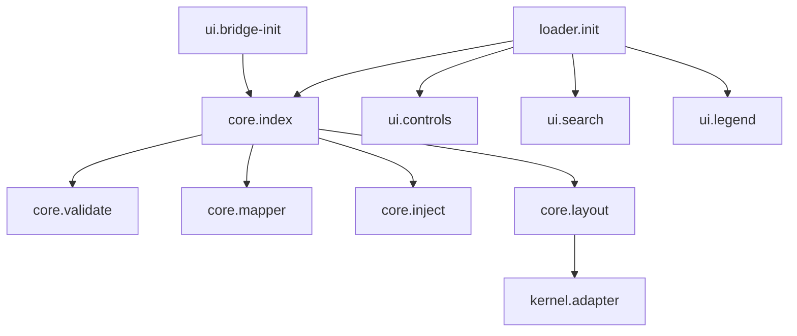

# CLD Architecture & Structure (New Layout)

## 1) Entry Points
- docs/test/water-cld.html lines 8-17 include base CSS and CLD bundle `../assets/dist/water-cld.bundle.css`, `water-cld.css`, `inline-migration.css`【F:docs/test/water-cld.html†L8-L17】
- docs/test/water-cld.html lines 238-248 load vendor libs and core modules `cytoscape.min.js`→`core/index.js`【F:docs/test/water-cld.html†L238-L248】
- docs/test/water-cld.html lines 272-274 load UI bridge and boot scripts (`bridge-init.js`, `water-cld.defer.js`, `water-cld.init.js`)【F:docs/test/water-cld.html†L272-L274】
- docs/water/cld/index.html lines 8-18 mirror production CSS/JS paths with canonical link【F:docs/water/cld/index.html†L8-L18】
- docs/water/cld/index.html lines 239-275 replicate vendor/core/UI scripts for live route【F:docs/water/cld/index.html†L239-L275】

## 2) Bootstrap Chain (sequence)
1) Optional CLD_LOADER.bootstrap kicks in when a model and cy exist, delegating to loader bootstrap【F:docs/assets/water-cld.js†L1710-L1716】
2) loader/init.js bootstrap wires core and UI: initCore, setModel, bindControls/search/legend【F:docs/assets/cld/loader/init.js†L4-L11】
3) core.initCore stores cy and applies default layout if provided【F:docs/assets/cld/core/index.js†L34-L50】
4) core.setModel validates then maps model to elements and injects into cy【F:docs/assets/cld/core/index.js†L53-L68】
5) core.runLayout executes chosen layout with fallback to dagre【F:docs/assets/cld/core/index.js†L76-L85】
6) UI controls call CORE.runLayout and applyFilters for user actions【F:docs/assets/cld/ui/controls.js†L4-L11】
7) kernel adapter observes #cy resize and triggers safe layout/fit on cy-ready/model events【F:docs/assets/cld/core/kernel/adapter.js†L4-L26】

## 3) Module Map
- core/: index.js, inject.js, layout.js, mapper.js, validate.js, store.js, kernel/adapter.js, kernel/shim.js, loop-detect.js, guards/batch-guard.js, guards/collection-guard.js【F:docs/assets/cld/core/index.js†L34-L50】【F:docs/assets/cld/core/inject.js†L1-L24】
- loader/: init.js, paths.js, runtime-guards.js【F:docs/assets/cld/loader/init.js†L1-L15】
- ui/: bridge-init.js, controls.js, legend.js, search.js【F:docs/assets/cld/ui/bridge-init.js†L1-L74】




## 4) Data Contract (Node/Edge + aliases)
- Node: { id, label, group? } with optional `_label` for stylesheet lookups【F:docs/assets/cld/core/mapper.js†L22-L40】【F:docs/assets/cld/ui/bridge-init.js†L25-L27】
- Edge: { id?, source, target, sign, weight?, delay? } plus `_signLabel` for positive/negative styling【F:docs/assets/cld/core/mapper.js†L23-L53】【F:docs/assets/cld/ui/bridge-init.js†L29-L33】

## 5) Cytoscape Instances
- water-cld.js builds the main instance `cytoscape({ container: el, elements: [] })` and signals ready【F:docs/assets/water-cld.js†L52-L70】
- core/store.js can create/adopt instances via `window.cytoscape(opts)` when init is called【F:docs/assets/cld/core/store.js†L80-L88】
- water-sfd.js spawns a standalone example graph for SFD demo【F:docs/assets/water-sfd.js†L6-L8】
- Source of truth for CLD runtime is the `cy` created in water-cld.js (exposed via `CLD_SAFE.cy`)【F:docs/assets/water-cld.js†L63-L66】

## 6) Injection Path
- core.setModel ➜ validateModel ➜ mapModelToElements ➜ CLD_CORE.inject/_cy.add【F:docs/assets/cld/core/index.js†L53-L68】
- inject() coerces arrays/objects and batches `cy.add`【F:docs/assets/cld/core/inject.js†L17-L24】
- graphStore.restore prefers CLD_CORE.inject but falls back to `cy.add` for arrays【F:docs/assets/cld/core/store.js†L112-L120】
- bridge-init reinjects elements if setModel yields zero or cy resets, preventing divergence【F:docs/assets/cld/ui/bridge-init.js†L37-L48】

## 7) Render Prereqs
- Container div `#cy` exists in HTML test/production pages【F:docs/test/water-cld.html†L212-L213】【F:docs/water/cld/index.html†L213】
- CSS enforces visible area: `#cy-wrap{min-height:560px}` and `#cy{min-height:520px;height:calc(100vh - 240px)}`【F:docs/assets/water-cld.css†L119-L121】
- Kernel adapter calls `cy.resize(); cy.fit(); cy.layout(...)` on resize and kernel events【F:docs/assets/cld/core/kernel/adapter.js†L4-L26】
- Layout/fit after inject ensures graph visible (`cy.fit()` in layoutstop)【F:docs/assets/water-cld.js†L575-L608】

## 8) Routes
- Test page `/test/water-cld.html` loads directly; `_redirects` map `/test/water-cld` to `/water/cld` (301)【F:docs/_redirects†L4-L8】
- Live page `/water/cld/` has canonical link to `https://wesh360.ir/water/cld/`【F:docs/water/cld/index.html†L8】
- Both routes currently served; ensure final production path `/water/cld/` remains canonical

## 9) Headers & CSP
- Global CSP denies inline styles except style-src-attr; no unsafe-inline for style elements【F:docs/_headers†L1-L6】
- `/test/*` loosens style-src-elem with `unsafe-inline` for Cytoscape testing【F:docs/_headers†L15-L17】
- `/water/cld*` sets text/html charset and relaxes style-src-elem/attr for runtime style injection【F:docs/_headers†L22-L26】

## 10) Tests & CI
- `npm test` runs mapper unit test and two Puppeteer E2E suites【F:package.json†L13】
- CI workflow tests on Node 18 & 22 with TS check, unit, E2E smoke, CSP scan and style gates【F:.github/workflows/ci.yml†L20-L120】
- cld-check workflow validates CLD HTML and build on pushes【F:.github/workflows/cld-check.yml†L1-L16】
- csp-inline-style-check enforces baseline for inline styles on pull requests【F:.github/workflows/csp-inline-style-check.yml†L1-L46】

## 11) Risks & Quick Wins
1. **Divergent injection paths** (bridge, store, direct `cy.add`) risk inconsistent graph state—standardize on `CLD_CORE.inject`.
2. **Global UMD modules** with no import graph complicate bundling; migrate to ES modules for clearer dependencies.
3. **CSP relaxations** only scoped for `/test/*` and `/water/cld*`; new CLD routes must update `_headers` to avoid broken styles.
4. **Resize observer reliance** in kernel adapter may fail in older browsers; add fallback `cy.resize()` on window resize.
5. **Fixed bundle filenames** (`water-cld.bundle.js/css`) rely on short cache; adding version hashes or cache-busting query params would reduce stale loads.

```json
{
  "entryPoints": {"test": "docs/test/water-cld.html", "live": "docs/water/cld/index.html"},
  "bootstrap": [
    "water-cld.js -> CLD_LOADER.bootstrap",
    "loader/init.js -> CORE.initCore/setModel + UI.bind",
    "core/index.js -> validate -> map -> inject -> runLayout",
    "ui/controls.js -> user runLayout/applyFilters",
    "kernel/adapter.js -> resize and fit"
  ],
  "modules": {
    "core": ["index.js","inject.js","layout.js","mapper.js","validate.js","store.js","kernel/adapter.js","kernel/shim.js","loop-detect.js","guards/batch-guard.js","guards/collection-guard.js"],
    "ui": ["bridge-init.js","controls.js","legend.js","search.js"],
    "loader": ["init.js","paths.js","runtime-guards.js"]
  },
  "dataContract": {
    "node": ["id","label","group","_label"],
    "edge": ["id","source","target","sign","weight","delay","_signLabel"]
  },
  "cyInstances": [
    "water-cld.js (primary)",
    "core/store.js adopt/create",
    "water-sfd.js demo"
  ],
  "inject": {
    "setModel": "core/index.js",
    "inject": "core/inject.js",
    "storeRestore": "core/store.js",
    "bridge": "ui/bridge-init.js"
  },
  "render": {
    "container": "#cy",
    "css": "water-cld.css",
    "resize": "kernel/adapter.js",
    "postLayoutFit": "water-cld.js"
  },
  "routes": {
    "test": "/test/water-cld.html",
    "live": "/water/cld/",
    "redirect": "/test/water-cld -> /water/cld (301)"
  },
  "headers": {
    "globalCSP": "default-src self; style-src-elem self",
    "testCSP": "style-src-elem self unsafe-inline",
    "liveCSP": "style-src-elem self unsafe-inline"
  },
  "tests": {
    "npm": "mapper unit + e2e smoke + behavior",
    "ci": ["TS check","unit","e2e smoke","CSP scan","inline-style scan"],
    "gates": ["cld-check","csp-inline-style-check"]
  },
  "risks": [
    "divergent injection paths",
    "global UMD modules",
    "CSP relaxations need updates",
    "ResizeObserver dependence",
    "fixed bundle filenames"
  ]
}
```
