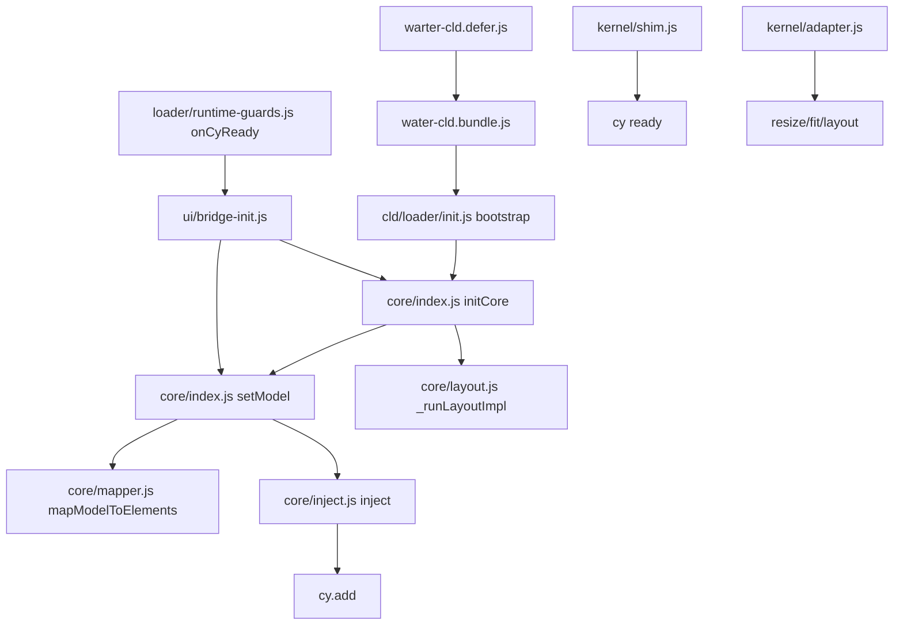

**Entry Points (HTML, script tags, bundles)**
- docs/test/water-cld.html:8: `<link rel="icon" …>`; 11–17: base + CLD CSS (`../assets/dist/water-cld.bundle.css`, `../assets/water-cld.css`, `../assets/inline-migration.css`)
- docs/test/water-cld.html:238–243: vendor scripts (`cytoscape.min.js`, `elk.bundled.js`, plugins, `chart.umd.min.js`)
- docs/test/water-cld.html:244–248: core facade scripts (`/assets/cld/core/{validate,mapper,inject,layout,index}.js`)
- docs/test/water-cld.html:272–274: page loader hooks (`/assets/water-cld.defer.js`, `/assets/water-cld.init.js`)
- docs/assets/cld-loader.js:1: auto-loader present to inject CSS and scripts when `#cy` exists (runtime option, not used by test HTML)
- docs/assets/dist/water-cld.manifest.json:1: lists bundled sources; bundle delivered at `docs/assets/dist/water-cld.bundle.{css,js}`

**Runtime Bootstrap Chain (sequence)**
- loader.defer: docs/assets/water-cld.defer.js:1: inserts `<script data-cld-bundle>` pointing to `assets/dist/water-cld.bundle.js` and fires `cld:bundle:loaded` on load
- core UMD load: docs/assets/cld/core/{validate,mapper,inject,layout,index}.js define `window.CLD_CORE.*`
- facade init: docs/assets/cld/core/index.js:33: `initCore({ cy, layout, defaultLayout? })` stores cy, optionally runs layout
- model mapping: docs/assets/cld/core/index.js:47–66: `setModel(raw)` → `mapModelToElements(model)` (docs/assets/cld/core/mapper.js:18) → coerces to array → `CLD_CORE.inject(cy, arr)`
- injection: docs/assets/cld/core/inject.js:23–25: `cy.batch(()=> cy.add(arr))`
- UI bridge: docs/assets/cld/ui/bridge-init.js:38–67: builds fallback elements and injects if needed; triggers `runLayout('grid')` for visibility in tests
- guards: docs/assets/cld/loader/runtime-guards.js:3–21: `onCyReady(cb)` helper; docs/assets/cld/core/kernel/shim.js:14–63: waits for `kernel`, `graph`, and `#cy` then resolves readiness
- resize/layout: docs/assets/cld/core/kernel/adapter.js:1–20: `ResizeObserver` on `#cy` to call `cy.resize(); cy.fit(); cy.layout({name:'dagre',…}).run()`

**Module Map (core/ui/loader) + Mermaid import graph**
- Core: `validate.js`, `mapper.js`, `inject.js`, `layout.js`, `index.js`, `store.js`, `kernel/{shim,adapter}.js`
- UI: `ui/{bridge-init,controls,legend,search}.js`
- Loader: `loader/{init,paths,runtime-guards}.js`, page-level `water-cld.{defer,init}.js`, optional `cld-loader.js`

**Data Contract (Node/Edge fields) + stylesheet aliases**
- Node (min): docs/assets/cld/core/types.d.ts:1: `{ id: string; label: string; group?: string }`
- Edge (min): docs/assets/cld/core/types.d.ts:2: `{ id?: string; source: string; target: string; sign?: '+'|'-'; weight?: number; delay?: number }`
- Mapper normalization: docs/assets/cld/core/mapper.js:18–42 (nodes: `id`, `label|name|title`, `group|type`); 44–64 (edges: `id?`, `source`, `target`, `sign|polarity`, `weight|w`, `delay|lag`)
- Validator expectations: docs/assets/cld/core/validate.js:26–41 (unique node ids, edges require `source`/`target`)
- Stylesheet aliases used by bridge: docs/assets/cld/ui/bridge-init.js:15–28 (`_label`, `_signLabel` set alongside `label`, `sign`)

**Cytoscape Instances (files and lines creating cy)**
- docs/assets/water-cld.js:60: `const cy = cytoscape({ container: el, elements: [] });`
- docs/assets/cld/core/store.js:88: `adopt(window.cytoscape(opts))` inside `graphStore.init({container})` (factory usage when called)
- docs/assets/water-sfd.js:6–26: demo SFD instance at `#cy-sfd` (not CLD; separate example)

**Injection Path (map/validate/inject sources)**
- docs/assets/cld/core/index.js:54–66: `setModel(raw)`: calls `validateModel(raw)` if present; uses `mapModelToElements(raw)`; coerces to array; injects via `CLD_CORE.inject(cy, arr)` or falls back to `_cy.add(arr)` (docs/assets/cld/core/index.js:68)
- docs/assets/cld/core/inject.js:23–25: `inject(cy, elements)` → `cy.add(arr)` in a batch
- docs/assets/cld/core/store.js:101–131: `restore(json)` normalizes `{elements}` to array, removes old elements, then `CLD_CORE.inject(cy, arr)` or `cy.add(arr)`
- docs/assets/cld/ui/bridge-init.js:38–67: builds `els` from model and injects via `CLD_CORE.inject(C, els)` or `C.add(els)`
- cy.add occurrences (non-dist):
  - docs/assets/cld/core/index.js:68
  - docs/assets/cld/core/inject.js:24
  - docs/assets/cld/core/store.js:116, 120
  - docs/assets/water-cld.js:1164
 - cy.json({elements …): NOT FOUND in source (see CI guard .github/workflows/ci.yml)

**Render Prereqs (container selectors, CSS min-height/resize)**
- Container selector: `#cy`
  - docs/assets/water-cld.js:54–64: selects `document.getElementById('cy')`, builds cy if present
  - docs/assets/cld/core/kernel/shim.js:15: `getCyEl = () => document.querySelector('#cy')`
- CSS min-height/size:
  - docs/assets/water-cld.css:19–26: `#cy { min-height: 480px; height: 100%; width: 100%; display:block; }`
  - docs/assets/water-cld.css:89–99: `#cy-wrap{min-height:560px;} #cy{min-height:520px;height:calc(100vh - 240px);…}`
- Resize/layout hooks:
  - docs/assets/cld/core/kernel/adapter.js:5–18: `ResizeObserver` on `#cy` → `cy.resize(); cy.fit(); cy.layout({name:'dagre',…}).run()`
  - docs/assets/cld/core/index.js:18–26: optional default layout via `CLD_CORE._runLayoutImpl` or `runLayout()`

**Routes (current `/test/water-cld`, target `/water/cld`) + redirects/canonical**
- Current test route: docs/test/water-cld.html:1
- Redirects: docs/_redirects:4–7 map legacy test aliases to `/test/water-cld.html`
- Target `/water/cld`: NOT FOUND (no `docs/water/cld/` present)
- Canonical link: NOT FOUND in docs/test/water-cld.html (no `<link rel="canonical">`)

**Headers & CSP (charset, style-src, relaxes)**
- Charset in HTML: docs/test/water-cld.html:4: `<meta charset="UTF-8" />`
- Global CSP: docs/_headers:1–6 `script-src 'self'; style-src-elem 'self'; style-src-attr 'unsafe-inline'` (strict by default)
- Relaxed for test pages: docs/_headers:13–15 `/test/*` → adds `style-src-elem 'unsafe-inline'` and keeps `style-src-attr 'unsafe-inline'` to allow Cytoscape inline `<style>`
- Asset caching: docs/_headers:17–18 `Cache-Control` for `/assets/cld/*`

**Tests & CI (scripts, status)**
- npm scripts:
  - package.json: "test": runs `tests/mapper.test.js`, `tests/e2e-cld.test.js`, `tests/e2e-water-cld.behaviors.test.js`
  - package.json: "e2e:smoke": `tests/e2e/cld-smoke.js`; "e2e:csp:fast": CSP scan with Puppeteer
  - package.json: "build:cld": builder for CLD bundle; "check:cld-html": HTML checks
- E2E tests reference `/test/water-cld.html`:
  - tests/e2e-cld.test.js:21–29 navigates to `/test/water-cld.html` and asserts `#cy`
  - tests/e2e-water-cld.behaviors.test.js:32–45 `waitReady`, verifies filters, search highlighting, presets
- CI workflows:
  - .github/workflows/ci.yml: runs TS check, unit mapper, E2E smoke, CSP fast, and source scan for `cy.json({elements)` banned usage
  - .github/workflows/cld-check.yml: runs `check:cld-html` and `build`
  - .github/workflows/csp-inline-style-check.yml: ratchets inline-style offenders vs baseline
  - .github/workflows/pages.yml: publishes `/docs` as GitHub Pages artifact

**Risks & Quick Wins**
- Risk: Missing production route `/water/cld` (only `/test/water-cld.html` exists). Redirect/canonical absent.
- Risk: CSP for non-test pages lacks `style-src-elem 'unsafe-inline'` required by Cytoscape inline `<style>`; production route will need targeted relax.
- Risk: Multiple code paths for injection (`CLD_CORE.inject`, `cy.add`, `graphStore.restore`) can diverge; ensure uniform use of `inject()`.
- Risk: Encoding artifacts present in several files (garbled comments/UI strings); verify meta charset and file encodings end-to-end.
- Risk: `getCy()` ambiguity (global vs facade); some modules assume global `getCy`; ensure consistent accessor via `CLD_CORE.getCy`.

---

JSON Summary
{
  "entryPoints": {
    "html": [
      "docs/test/water-cld.html:11",
      "docs/test/water-cld.html:15",
      "docs/test/water-cld.html:238"
    ],
    "bundle": "docs/assets/dist/water-cld.bundle.{css,js}",
    "autoLoader": "docs/assets/cld-loader.js:1"
  },
  "bootstrap": [
    "water-cld.defer -> bundle load -> cld:bundle:loaded",
    "core UMD define -> CLD_CORE.* available",
    "initCore(cy) -> setModel(model) -> inject(cy, arr) -> cy.add",
    "ui.bridge-init fallback inject + runLayout",
    "kernel shim + adapter handle readiness and resize"
  ],
  "modules": {
    "core": ["validate.js","mapper.js","inject.js","layout.js","index.js","store.js","kernel/shim.js","kernel/adapter.js"],
    "ui": ["bridge-init.js","controls.js","legend.js","search.js"],
    "loader": ["init.js","paths.js","runtime-guards.js"],
    "page": ["water-cld.defer.js","water-cld.init.js"]
  },
  "dataContract": {
    "node": ["id","label","group?"],
    "edge": ["id?","source","target","sign?","weight?","delay?"],
    "aliases": ["label|name|title","group|type","sign|polarity","weight|w","delay|lag","_label","_signLabel"]
  },
  "cyInstances": [
    "docs/assets/water-cld.js:60",
    "docs/assets/cld/core/store.js:88",
    "docs/assets/water-sfd.js:6"
  ],
  "inject": {
    "setModel": "docs/assets/cld/core/index.js:54",
    "injectFn": "docs/assets/cld/core/inject.js:23",
    "storeRestore": "docs/assets/cld/core/store.js:101",
    "uiBridge": "docs/assets/cld/ui/bridge-init.js:53"
  },
  "render": {
    "container": "#cy",
    "css": [
      "docs/assets/water-cld.css:19",
      "docs/assets/water-cld.css:89"
    ],
    "resize": [
      "docs/assets/cld/core/kernel/adapter.js:5",
      "docs/assets/cld/core/index.js:18"
    ]
  },
  "routes": {
    "currentTest": "/test/water-cld.html",
    "target": "/water/cld (NOT FOUND)",
    "redirects": ["docs/_redirects:4-7"],
    "canonical": "NOT FOUND"
  },
  "headers": {
    "metaCharset": "docs/test/water-cld.html:4",
    "globalCSP": "docs/_headers:1-6",
    "testCSPRelax": "docs/_headers:13-15"
  },
  "tests": {
    "scripts": ["test","e2e:smoke","e2e:csp:fast","test:unit:mapper"],
    "e2eEntry": "/test/water-cld.html",
    "workflows": ["ci.yml","cld-check.yml","csp-inline-style-check.yml","pages.yml"]
  },
  "risks": [
    "Missing /water/cld route",
    "CSP needs 'unsafe-inline' for style on CLD routes",
    "Divergent inject paths",
    "Encoding artifacts",
    "getCy accessor inconsistency"
  ]
}

**Quick Wins (top 5)**
- Add `docs/water/cld/index.html` using `cld-loader.js`; add 301 from `/test/water-cld` to `/water/cld` in `docs/_redirects`.
- In `docs/_headers`, add a scoped rule for `/water/cld*` with `style-src-elem 'self' 'unsafe-inline'` (keep global strict).
- Consolidate injection to `CLD_CORE.inject()` everywhere; keep `cy.json({elements})` only in dist-safe patches if needed.
- Add `<link rel="canonical" href="/water/cld/">` to the new page; update tests to hit `/water/cld/`.
- Replace ad-hoc globals (`getCy`) with `CLD_CORE.getCy()` across UI/loader to reduce ambiguity.
