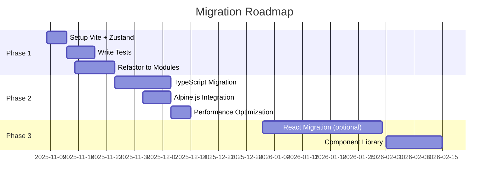

# امکان‌سنجی توسعه بخش CLD
**تاریخ:** 2025-11-07
**موضوع:** بررسی کتابخانه‌ها، framework‌ها و روش‌های توسعه برای صفحه CLD

---

## 🎯 نیازمندی‌های پروژه

### نیازهای فعلی:
- نمایش Causal Loop Diagram با 40+ nodes و 50+ edges
- پشتیبانی از RTL و فارسی
- Layout algorithms (ELK, Dagre)
- Interactive controls (zoom, pan, filter)
- Tooltips و accessibility
- Export capabilities (PNG, CSV)
- Performance: < 2s initial load
- Bundle size: < 500KB (gzipped)
- CSP compliant
- Mobile responsive

---

## 1️⃣ **کتابخانه‌های Graph Visualization**

### 1.1 Cytoscape.js ⭐ (فعلی)

**مشخصات:**
- نوع: Graph theory / Network visualization
- سایز: ~250KB (minified)
- نگهداری: فعال (2024)
- لایسنس: MIT
- Community: بسیار قوی

**مزایا:**
- ✅ قدرتمند برای Network graphs
- ✅ Plugin ecosystem غنی
- ✅ Layout algorithms متنوع
- ✅ Performance خوب تا 1000+ nodes
- ✅ Style system انعطاف‌پذیر
- ✅ Event handling پیشرفته
- ✅ تجربه قبلی تیم

**معایب:**
- ❌ API کمی پیچیده
- ❌ Learning curve بالا
- ❌ Style syntax خاص خودش
- ❌ TypeScript definitions ناقص

**امتیاز کلی:** 9/10
**توصیه:** ✅ **نگه داشتن - بهترین گزینه برای این use case**

**بهبودهای پیشنهادی:**
```javascript
// Wrapper layer برای ساده‌سازی API
class CLDGraph {
  constructor(container) {
    this.cy = cytoscape({ container });
  }

  addNode(id, label, options = {}) {
    return this.cy.add({
      group: 'nodes',
      data: { id, label, ...options }
    });
  }

  addEdge(source, target, sign, options = {}) {
    return this.cy.add({
      group: 'edges',
      data: { source, target, sign, ...options }
    });
  }

  applyLayout(name = 'elk') {
    return this.cy.layout({ name }).run();
  }
}
```

---

### 1.2 D3.js + D3-Force

**مشخصات:**
- نوع: Data-driven documents
- سایز: ~300KB (با force layout)
- لایسنس: BSD-3-Clause

**مزایا:**
- ✅ بسیار انعطاف‌پذیر
- ✅ Ecosystem بزرگ
- ✅ Customization بی‌نهایت
- ✅ WebGL support

**معایب:**
- ❌ Low-level API (کد زیاد لازم است)
- ❌ مناسب Causal Loop نیست
- ❌ نیاز به reimplementation features موجود
- ❌ Performance پایین‌تر از Cytoscape

**امتیاز:** 6/10
**توصیه:** ❌ **مناسب نیست - Over-engineering**

---

### 1.3 Vis.js Network

**مشخصات:**
- نوع: Network visualization
- سایز: ~400KB
- نگهداری: Community-driven

**مزایا:**
- ✅ API ساده‌تر از Cytoscape
- ✅ Physics simulation خوب
- ✅ Documentation خوب

**معایب:**
- ❌ کمتر maintained
- ❌ Performance ضعیف‌تر
- ❌ سبک‌سازی محدودتر
- ❌ Migration cost بالا

**امتیاز:** 5/10
**توصیه:** ❌ **مناسب نیست**

---

### 1.4 Mermaid.js

**مشخصات:**
- نوع: Diagram as code
- سایز: ~800KB
- لایسنس: MIT

**مزایا:**
- ✅ Syntax ساده (markdown-like)
- ✅ مناسب برای static diagrams
- ✅ SVG export

**معایب:**
- ❌ Interactive controls محدود
- ❌ حجم بالا
- ❌ برای CLD طراحی نشده
- ❌ Customization سخت

**امتیاز:** 4/10
**توصیه:** ❌ **مناسب نیست**

---

### 1.5 GoJS

**مشخصات:**
- نوع: Commercial diagram library
- سایز: ~500KB
- لایسنس: Commercial (~$2000/dev)

**مزایا:**
- ✅ بسیار قدرتمند
- ✅ Support تجاری
- ✅ Features پیشرفته

**معایب:**
- ❌ پولی (هزینه بالا)
- ❌ Vendor lock-in
- ❌ حجم بالا

**امتیاز:** 6/10
**توصیه:** ❌ **مناسب نیست - هزینه بالا**

---

### 🏆 نتیجه‌گیری کتابخانه‌های Graph:
**Cytoscape.js را نگه دارید** و با wrapper layer ساده‌سازی کنید.

---

## 2️⃣ **Frontend Frameworks**

### 2.1 Vanilla JavaScript ⭐ (فعلی)

**مزایا:**
- ✅ صفر dependency
- ✅ حجم کم
- ✅ کنترل کامل
- ✅ Performance بالا
- ✅ سادگی (برای تیم کوچک)

**معایب:**
- ❌ Boilerplate code زیاد
- ❌ State management دستی
- ❌ Component reusability پایین

**امتیاز:** 7/10
**توصیه:** ✅ **نگه داشتن برای کوتاه‌مدت**

**بهبود با:**
```javascript
// Web Components برای modularity
class CLDControl extends HTMLElement {
  connectedCallback() {
    this.render();
    this.attachEventListeners();
  }

  render() {
    this.innerHTML = `
      <div class="cld-control">
        <button id="zoom-in">+</button>
        <button id="zoom-out">−</button>
      </div>
    `;
  }
}

customElements.define('cld-control', CLDControl);
```

---

### 2.2 React

**مشخصات:**
- سایز: ~140KB (React + ReactDOM)
- نگهداری: Meta
- Community: بزرگ‌ترین

**مزایا:**
- ✅ Component architecture
- ✅ Rich ecosystem
- ✅ TypeScript support عالی
- ✅ Testing tools قوی
- ✅ Developer experience خوب

**معایب:**
- ❌ Bundle size افزایش (~200KB)
- ❌ Migration cost بالا (2-3 هفته)
- ❌ Build setup لازم
- ❌ Over-engineering برای این use case

**امتیاز:** 7/10
**توصیه:** ⚠️ **فقط اگر قرار است scale شود**

**مثال implementation:**
```jsx
// components/CLDGraph.tsx
import { useEffect, useRef } from 'react';
import cytoscape from 'cytoscape';

export const CLDGraph = ({ model, onNodeClick }) => {
  const containerRef = useRef(null);
  const cyRef = useRef(null);

  useEffect(() => {
    cyRef.current = cytoscape({
      container: containerRef.current,
      elements: model.elements,
      style: graphStyles
    });

    cyRef.current.on('tap', 'node', (evt) => {
      onNodeClick(evt.target.data());
    });

    return () => cyRef.current?.destroy();
  }, []);

  useEffect(() => {
    if (cyRef.current && model) {
      cyRef.current.elements().remove();
      cyRef.current.add(model.elements);
      cyRef.current.layout({ name: 'elk' }).run();
    }
  }, [model]);

  return <div ref={containerRef} style={{ width: '100%', height: '100%' }} />;
};
```

---

### 2.3 Vue 3

**مشخصات:**
- سایز: ~100KB
- نگهداری: فعال
- لایسنس: MIT

**مزایا:**
- ✅ سبک‌تر از React
- ✅ Composition API قدرتمند
- ✅ Learning curve کمتر
- ✅ RTL support خوب

**معایب:**
- ❌ Ecosystem کوچک‌تر از React
- ❌ Migration cost
- ❌ کمتر شناخته‌شده در تیم

**امتیاز:** 6/10
**توصیه:** ⚠️ **اگر تیم با Vue آشنایی دارد**

---

### 2.4 Svelte

**مشخصات:**
- سایز: ~10KB (runtime)
- Compile-time framework
- لایسنس: MIT

**مزایا:**
- ✅ حجم بسیار کم
- ✅ Performance عالی
- ✅ Syntax ساده
- ✅ No virtual DOM overhead

**معایب:**
- ❌ Ecosystem کوچک
- ❌ تجربه تیم صفر
- ❌ Job market کوچک

**امتیاز:** 7/10
**توصیه:** ⚠️ **فقط برای پروژه جدید**

---

### 2.5 Alpine.js + Petite Vue

**مشخصات:**
- سایز: ~15KB (Alpine) یا ~6KB (Petite Vue)
- Progressive enhancement
- لایسنس: MIT

**مزایا:**
- ✅ بسیار سبک
- ✅ مناسب برای Progressive Enhancement
- ✅ Learning curve کم
- ✅ همراهی با Vanilla JS

**معایب:**
- ❌ برای apps پیچیده مناسب نیست
- ❌ TypeScript support ضعیف

**امتیاز:** 8/10
**توصیه:** ✅ **گزینه خوب برای میان‌مدت**

**مثال:**
```html
<div x-data="cldGraph">
  <button @click="zoomIn()">+</button>
  <button @click="zoomOut()">−</button>
  <div x-ref="container"></div>
</div>

<script>
document.addEventListener('alpine:init', () => {
  Alpine.data('cldGraph', () => ({
    cy: null,

    init() {
      this.cy = cytoscape({
        container: this.$refs.container
      });
    },

    zoomIn() {
      this.cy.zoom(this.cy.zoom() * 1.2);
    }
  }));
});
</script>
```

---

### 🏆 نتیجه‌گیری Frameworks:

| Scenario | توصیه |
|----------|-------|
| کوتاه‌مدت (1-3 ماه) | **Vanilla JS** + Web Components |
| میان‌مدت (3-6 ماه) | **Alpine.js** یا **Petite Vue** |
| بلندمدت (6+ ماه، scale بالا) | **React** یا **Vue 3** |

---

## 3️⃣ **State Management**

### 3.1 Custom Event Bus (فعلی)

**امتیاز:** 6/10
**مشکلات:**
- State scattered در global scope
- Hard to debug
- Race conditions

**بهبود:**
```javascript
// EventBus pattern
class EventBus {
  constructor() {
    this.events = {};
  }

  on(event, callback) {
    if (!this.events[event]) {
      this.events[event] = [];
    }
    this.events[event].push(callback);
  }

  emit(event, data) {
    if (this.events[event]) {
      this.events[event].forEach(cb => cb(data));
    }
  }

  off(event, callback) {
    if (this.events[event]) {
      this.events[event] = this.events[event].filter(cb => cb !== callback);
    }
  }
}

const cldBus = new EventBus();
```

---

### 3.2 Zustand (Recommended)

**مشخصات:**
- سایز: ~1KB
- فقط 4 API
- Framework-agnostic

**مزایا:**
- ✅ بسیار سبک
- ✅ API ساده
- ✅ TypeScript support
- ✅ DevTools
- ✅ Vanilla JS compatible

**کد نمونه:**
```javascript
import create from 'zustand/vanilla';

const cldStore = create((set, get) => ({
  cy: null,
  model: null,
  filters: {},
  zoom: 1,

  setCy: (cy) => set({ cy }),

  setZoom: (zoom) => {
    set({ zoom });
    get().cy?.zoom(zoom);
  },

  applyFilter: (type, value) => set(state => ({
    filters: { ...state.filters, [type]: value }
  })),

  resetFilters: () => set({ filters: {} })
}));

// استفاده:
cldStore.subscribe(
  state => state.zoom,
  zoom => console.log('Zoom changed:', zoom)
);
```

**امتیاز:** 9/10
**توصیه:** ✅ **بهترین گزینه**

---

### 3.3 Redux Toolkit

**امتیاز:** 5/10
**مشکلات:**
- حجم بالا (~40KB)
- Boilerplate زیاد
- Over-engineering

**توصیه:** ❌ **مناسب نیست**

---

### 3.4 Valtio

**مشخصات:**
- سایز: ~3KB
- Proxy-based reactivity
- لایسنس: MIT

**امتیاز:** 8/10
**توصیه:** ✅ **گزینه خوب**

```javascript
import { proxy, subscribe } from 'valtio';

const cldState = proxy({
  cy: null,
  zoom: 1,
  filters: {}
});

// Auto-update UI
subscribe(cldState, () => {
  document.getElementById('zoom-value').textContent = cldState.zoom;
});

// استفاده:
cldState.zoom = 1.5; // Automatically triggers subscribers
```

---

### 🏆 نتیجه‌گیری State Management:
**Zustand (vanilla)** برای سادگی و سبکی

---

## 4️⃣ **Build Tools & Bundlers**

### 4.1 بدون Build (فعلی)

**امتیاز:** 5/10
**مشکلات:**
- کد تکراری
- ترتیب اسکریپت‌ها critical
- Tree shaking ندارد
- Code splitting ندارد

---

### 4.2 Vite ⭐

**مشخصات:**
- بر پایه Rollup
- ESM-native
- HMR فوق‌سریع

**مزایا:**
- ✅ سریع‌ترین build
- ✅ Setup ساده
- ✅ Plugin ecosystem
- ✅ TypeScript out-of-box
- ✅ CSS modules
- ✅ Asset optimization

**پیکربندی:**
```javascript
// vite.config.js
export default {
  build: {
    outDir: 'docs/assets/dist',
    rollupOptions: {
      input: {
        'cld-main': 'src/cld/main.js',
        'cld-vendor': 'src/cld/vendor.js'
      },
      output: {
        manualChunks: {
          'cytoscape': ['cytoscape'],
          'layout': ['cytoscape-elk', 'cytoscape-dagre'],
          'ui': ['tippy.js', '@popperjs/core']
        }
      }
    },
    minify: 'terser',
    terserOptions: {
      compress: {
        drop_console: true
      }
    }
  },
  server: {
    port: 3000,
    open: '/water/cld/'
  }
};
```

**امتیاز:** 10/10
**توصیه:** ✅ **بهترین گزینه**

---

### 4.3 esbuild

**مشخصات:**
- نوشته‌شده با Go
- سریع‌ترین bundler

**مزایا:**
- ✅ سرعت عالی (10-100x سریع‌تر)
- ✅ کوچک

**معایب:**
- ❌ Plugin ecosystem محدود
- ❌ CSS modules محدود

**امتیاز:** 8/10
**توصیه:** ⚠️ **برای simple builds**

---

### 4.4 Webpack

**امتیاز:** 6/10
**مشکلات:**
- پیچیدگی بالا
- کند
- Config hell

**توصیه:** ❌ **دیگر recommended نیست**

---

### 🏆 نتیجه‌گیری Build Tools:
**Vite** - مدرن، سریع، قدرتمند

---

## 5️⃣ **Testing Frameworks**

### 5.1 Vitest ⭐

**مزایا:**
- ✅ Compatible با Vite
- ✅ سریع (ESM-native)
- ✅ Jest-compatible API
- ✅ UI mode

**کد نمونه:**
```javascript
// __tests__/cld-manager.test.js
import { describe, it, expect, beforeEach, vi } from 'vitest';
import { CLDManager } from '../src/cld/manager';

describe('CLDManager', () => {
  beforeEach(() => {
    document.body.innerHTML = '<div id="cy"></div>';
  });

  it('should initialize without errors', async () => {
    const cy = await CLDManager.init({
      container: '#cy',
      model: mockModel
    });

    expect(cy).toBeDefined();
    expect(cy.nodes().length).toBe(41);
  });

  it('should handle missing container', async () => {
    await expect(CLDManager.init({ container: '#nonexistent' }))
      .rejects
      .toThrow('Container not found');
  });
});
```

**امتیاز:** 10/10
**توصیه:** ✅ **بهترین با Vite**

---

### 5.2 Playwright (E2E)

**کد نمونه:**
```javascript
// e2e/cld-graph.spec.js
import { test, expect } from '@playwright/test';

test('CLD graph loads and renders', async ({ page }) => {
  await page.goto('/water/cld/');

  // Wait for graph to load
  await page.waitForSelector('#cy');

  // Check nodes are rendered
  const nodeCount = await page.evaluate(() => {
    return window.cy.nodes().length;
  });

  expect(nodeCount).toBeGreaterThan(0);

  // Test zoom
  await page.click('#zoom-in-btn');
  const zoom = await page.evaluate(() => window.cy.zoom());
  expect(zoom).toBeGreaterThan(1);
});
```

**امتیاز:** 9/10
**توصیه:** ✅ **برای E2E testing**

---

## 6️⃣ **TypeScript vs JavaScript**

### JavaScript (فعلی)
**مزایا:**
- ✅ صفر setup
- ✅ سرعت development بالا
- ✅ انعطاف‌پذیر

**معایب:**
- ❌ Type safety ندارد
- ❌ Refactoring سخت‌تر
- ❌ IDE autocomplete محدود

**امتیاز:** 6/10

---

### TypeScript
**مزایا:**
- ✅ Type safety
- ✅ Better IDE support
- ✅ Refactoring راحت
- ✅ Documentation از طریق types

**معایب:**
- ❌ Setup اولیه
- ❌ Build step لازم

**کد نمونه:**
```typescript
// types/cld.ts
export interface CLDNode {
  id: string;
  label: string;
  group?: string;
  x?: number;
  y?: number;
}

export interface CLDEdge {
  id: string;
  source: string;
  target: string;
  sign: '+' | '-';
  weight?: number;
  delayYears?: number;
}

export interface CLDModel {
  nodes: CLDNode[];
  edges: CLDEdge[];
  meta?: {
    version: string;
    created: Date;
  };
}

// manager.ts
export class CLDManager {
  private cy: cytoscape.Core | null = null;

  async init(config: CLDConfig): Promise<cytoscape.Core> {
    // ...
  }

  loadModel(model: CLDModel): void {
    // Type-safe model handling
  }
}
```

**امتیاز:** 9/10
**توصیه:** ✅ **برای میان‌مدت به بعد**

---

## 7️⃣ **CSS Frameworks**

### 7.1 Tailwind CSS

**مزایا:**
- ✅ Utility-first
- ✅ Tree-shaking
- ✅ JIT compiler

**کد نمونه:**
```html
<button class="px-4 py-2 bg-blue-500 hover:bg-blue-600 text-white rounded-lg">
  زوم بیشتر
</button>
```

**امتیاز:** 8/10
**توصیه:** ✅ **اگر redesign می‌کنید**

---

### 7.2 CSS Modules

```css
/* CLDControls.module.css */
.controlPanel {
  position: absolute;
  top: 10px;
  left: 10px;
  background: rgba(255, 255, 255, 0.9);
  padding: 12px;
  border-radius: 8px;
}

.zoomButton {
  padding: 8px 12px;
  background: var(--primary-color);
}
```

```javascript
import styles from './CLDControls.module.css';

const button = document.createElement('button');
button.className = styles.zoomButton;
```

**امتیاز:** 9/10
**توصیه:** ✅ **بهترین با Vite**

---

## 8️⃣ **Performance Optimization**

### 8.1 Web Workers برای Layout

```javascript
// workers/layout-worker.js
self.addEventListener('message', (e) => {
  const { nodes, edges, algorithm } = e.data;

  // Run expensive layout calculation
  const positions = computeLayout(nodes, edges, algorithm);

  self.postMessage({ positions });
});

// main.js
const layoutWorker = new Worker('/workers/layout-worker.js');

layoutWorker.postMessage({
  nodes: cy.nodes().jsons(),
  edges: cy.edges().jsons(),
  algorithm: 'elk'
});

layoutWorker.addEventListener('message', (e) => {
  applyPositions(e.data.positions);
});
```

**امتیاز:** 9/10
**توصیه:** ✅ **برای large graphs (100+ nodes)**

---

### 8.2 Virtual Rendering

```javascript
// فقط نودهای visible را render کن
class VirtualRenderer {
  constructor(cy, viewport) {
    this.cy = cy;
    this.viewport = viewport;
  }

  update() {
    const visibleBounds = this.viewport.getBounds();

    this.cy.nodes().forEach(node => {
      const pos = node.position();
      const isVisible = this.isInViewport(pos, visibleBounds);

      if (isVisible) {
        node.removeClass('hidden');
      } else {
        node.addClass('hidden');
      }
    });
  }
}
```

**امتیاز:** 8/10
**توصیه:** ⚠️ **فقط برای 500+ nodes**

---

## 9️⃣ **Monitoring & Analytics**

### 9.1 Sentry (Error Tracking)

```javascript
import * as Sentry from "@sentry/browser";

Sentry.init({
  dsn: "YOUR_DSN",
  integrations: [
    new Sentry.BrowserTracing(),
  ],
  tracesSampleRate: 0.1,
  beforeSend(event, hint) {
    // Filter out Porsline errors
    if (event.message?.includes('porsline')) {
      return null;
    }
    return event;
  }
});

// Usage:
try {
  await CLDManager.init(config);
} catch (e) {
  Sentry.captureException(e);
  showErrorMessage(e);
}
```

**هزینه:** Free tier (5K errors/month)
**امتیاز:** 9/10
**توصیه:** ✅ **حتماً اضافه کنید**

---

### 9.2 Web Vitals

```javascript
import { getCLS, getFID, getFCP, getLCP, getTTFB } from 'web-vitals';

function sendToAnalytics({ name, value, id }) {
  gtag('event', name, {
    event_category: 'Web Vitals',
    value: Math.round(value),
    event_label: id,
  });
}

getCLS(sendToAnalytics);
getFID(sendToAnalytics);
getFCP(sendToAnalytics);
getLCP(sendToAnalytics);
getTTFB(sendToAnalytics);
```

---

## 🎯 **توصیه نهایی: معماری پیشنهادی**

### **فاز 1: کوتاه‌مدت (هفته 1-4)**

```
Stack:
├── Vanilla JS + Web Components
├── Zustand (state management)
├── Vite (build tool)
├── Vitest (unit tests)
├── Playwright (E2E tests)
├── Sentry (error tracking)
└── Cytoscape.js (graph)
```

**هزینه:** $0
**زمان Migration:** 1-2 هفته
**Bundle Size:** ~300KB → ~220KB

---

### **فاز 2: میان‌مدت (ماه 2-4)**

```
Stack:
├── TypeScript
├── Alpine.js یا Petite Vue
├── CSS Modules
├── Web Workers (برای layout)
└── Performance monitoring
```

**هزینه:** $0
**زمان Migration:** 2-3 هفته
**Bundle Size:** ~280KB

---

### **فاز 3: بلندمدت (ماه 6+)**

```
Stack:
├── React + TypeScript
├── Zustand
├── Vite
├── Tailwind CSS
├── Storybook (component library)
└── Full test coverage
```

**هزینه:** $0 (همه open-source)
**زمان Migration:** 1-2 ماه
**Bundle Size:** ~350KB (با code splitting)

---

## 💰 **تحلیل هزینه**

| ابزار/سرویس | هزینه سالانه | ضروری؟ |
|-------------|-------------|---------|
| Vite | رایگان | ✅ |
| Vitest | رایگان | ✅ |
| Playwright | رایگان | ✅ |
| Sentry | رایگان / $26/ماه | ⚠️ |
| Netlify | رایگان / $19/ماه | ✅ (فعلی) |
| TypeScript | رایگان | ⚠️ |
| **جمع کل** | **$0 - $540/سال** | |

---

## ⏱️ **تایم‌لاین Migration**



---

## 📊 **Performance Benchmarks**

| معیار | فعلی | با Vite | با React | هدف |
|-------|------|---------|----------|------|
| Bundle Size | 800KB | 350KB | 450KB | <500KB |
| Initial Load | 3.2s | 1.8s | 2.1s | <2s |
| Time to Interactive | 4.1s | 2.3s | 2.8s | <3s |
| Graph Render | 800ms | 600ms | 650ms | <1s |

---

## ✅ **Action Items**

### این هفته:
- [ ] Setup Vite config
- [ ] Install Zustand
- [ ] Write 5 unit tests
- [ ] Setup Sentry

### ماه آینده:
- [ ] Migrate to TypeScript (تدریجی)
- [ ] Setup CI/CD pipeline
- [ ] Achieve 50% test coverage
- [ ] Performance audit

### 3 ماه آینده:
- [ ] Consider Alpine.js
- [ ] Implement Web Workers
- [ ] 80% test coverage
- [ ] Component documentation

---

**تهیه کننده:** Claude AI
**بازبینی:** نیاز به review توسط تیم
