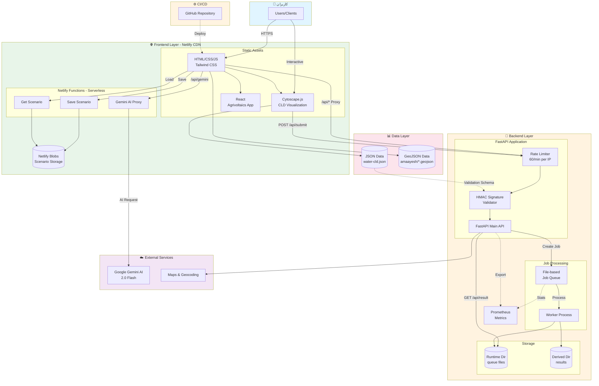
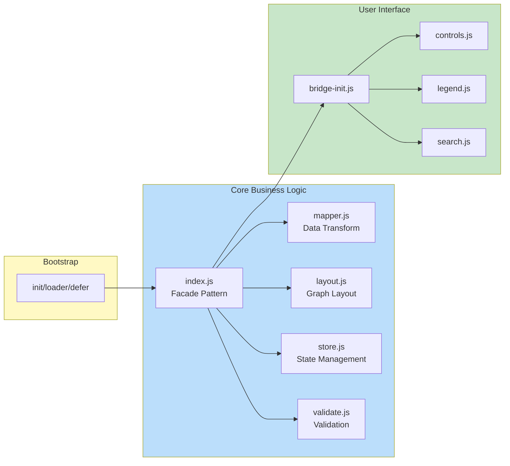

# WESH360 System Architecture

معماری سیستم WESH360 - Water & Energy Synergy Hub

## نمای کلی معماری



## شرح کامپوننت‌ها

### Frontend Layer (Netlify CDN)

#### Static Assets
- **HTML/CSS/JS + Tailwind CSS**: صفحات استاتیک با Tailwind CSS
- **Cytoscape.js CLD Visualization**: نمایش تعاملی Causal Loop Diagram
- **React Agrivoltaics App**: اپلیکیشن محاسبه‌گر کشاورزی خورشیدی

#### Netlify Functions (Serverless)
- **Gemini AI Proxy** (`/api/gemini`): پروکسی برای Google Generative AI
- **Save Scenario** (`/api/save-scenario`): ذخیره سناریوهای کاربر در Netlify Blobs
- **Get Scenario** (`/api/get-scenario`): بارگذاری سناریوهای ذخیره شده

#### Storage
- **Netlify Blobs**: ذخیره‌سازی سناریوهای کاربر

---

### Backend Layer

#### FastAPI Application
- **FastAPI Main API**: API اصلی سیستم
  - `POST /api/submit`: ثبت داده‌های گراف با اعتبارسنجی signature
  - `GET /api/result/{job_id}`: دریافت نتیجه Job
  - `GET /api/health`: Health check
  - `GET /metrics`: Prometheus metrics
  - `GET /version`: نسخه API

- **Rate Limiter**: محدودیت 60 درخواست در دقیقه به ازای هر IP (Token bucket)
- **HMAC Signature Validator**: اعتبارسنجی امضای درخواست‌ها

#### Job Processing
- **File-based Job Queue**: صف Job ها در فایل سیستم
  - `{job_id}.in.json`: ورودی
  - `{job_id}.state`: وضعیت (queued/processing/done/failed)
  - `{job_id}.out.json`: خروجی

- **Worker Process**: پردازش کننده Job ها

#### Storage
- **Runtime Directory**: فایل‌های صف و وضعیت
- **Derived Directory**: نتایج پردازش شده

#### Monitoring
- **Prometheus Metrics**: آمارهای صف Job ها

---

### External Services

- **Google Gemini AI 2.0 Flash**: سرویس هوش مصنوعی
- **Maps & Geocoding APIs**: سرویس‌های نقشه و geocoding

---

### Data Layer

- **JSON Data** (`water-cld.json`): تعریف گراف CLD
- **GeoJSON Data** (`amaayesh/*.geojson`): داده‌های جغرافیایی محیط زیست

---

## جریان داده (Data Flow)

### 1. Frontend → Backend API
```
User → HTML/CLD → Rate Limiter → Signature Validator → API → Job Queue
                                                        ↓
                                                    Worker → Results
```

### 2. Frontend → Netlify Functions
```
User → HTML → Gemini Proxy → Google AI
            → Save Scenario → Netlify Blobs
            → Get Scenario → Netlify Blobs
```

### 3. CI/CD Pipeline
```
GitHub → Actions → Build → Deploy → Netlify CDN
```

---

## تکنولوژی‌های استفاده شده

| لایه | تکنولوژی | توضیح |
|------|----------|-------|
| **Frontend Host** | Netlify | CDN + Static hosting |
| **Frontend Build** | npm + Tailwind | CSS-first design |
| **Visualization** | Cytoscape.js | Interactive graph rendering |
| **Backend Framework** | FastAPI + Uvicorn | Async Python framework |
| **Serverless** | Netlify Functions | AI proxy + data storage |
| **Storage** | Netlify Blobs + File System | Scenario persistence + Job queue |
| **Data Format** | JSON + GeoJSON | Graph + geographic data |
| **CI/CD** | GitHub Actions | Automated tests & deploy |
| **Caching** | HTTP headers | Netlify CDN + browser |
| **Security** | CORS + HMAC | Origin validation + signature verification |
| **Monitoring** | Prometheus | Metrics collection |

---

## امنیت (Security)

### CORS Policy
```
Allowed Origins: wesh360.ir, localhost:8010
```

### Rate Limiting
```
Algorithm: Token Bucket
Rate: 60 tokens/minute per IP
```

### HMAC Signature Validation
```
POST /api/submit:
  - Requires HMAC-SHA256 signature
  - Secret: API_HMAC_SECRET (environment variable)
  - Validates JSON schema against cld.schema.json
```

---

## محیط توسعه (Development)

### Environment Variables

#### Backend (`/backend/.env`)
```bash
API_HOST=127.0.0.1
API_PORT=8010
API_RUNTIME_DIR=C:\wesh360\data\runtime
API_DERIVED_DIR=C:\wesh360\data\derived
API_HMAC_SECRET=CHANGE_ME
ALLOWED_ORIGINS=https://wesh360.ir,http://localhost:8010
```

#### Frontend (Netlify)
```bash
GEMINI_API_KEY=<secret>
GEMINI_MODEL=gemini-2.0-flash-exp
NODE_VERSION=18
```

---

## Build & Deployment

### Build Commands
```bash
npm run build           # Full build (CSS + CLD bundle)
npm run build:css      # Tailwind compilation
npm run build:cld      # CLD bundle generation
npm run build:agri     # Agrivoltaics app
npm run test           # Run E2E + unit tests
```

### Deployment
- **Platform**: Netlify
- **Publish Directory**: `/docs`
- **Build Command**: `npm ci && npm run build`
- **Node Version**: 18 (production), 22 (preview)
- **Functions**: `/netlify/functions`

### Redirects (netlify.toml)
```
/api/* → https://api.wesh360.ir/:splat
```

---

## مانیتورینگ و متریک‌ها (Monitoring)

### Prometheus Metrics
```
GET /metrics
  - jobs_queued_total
  - jobs_processing_total
  - jobs_done_total
  - jobs_failed_total
```

### Health Check
```
GET /api/health
  - Returns: {"status": "ok", "timestamp": ...}
```

---

## فایل‌های کلیدی

### Frontend Entry Points
```
/docs/water/cld/index.html
/docs/assets/dist/water-cld.bundle.js
/docs/assets/cld/core/index.js
```

### Backend Entry Point
```
/backend/app/main.py
```

### Configuration
```
/netlify.toml
/backend/.env.example
```

### Data Sources
```
/docs/data/water-cld.json
/docs/data/amaayesh/*.geojson
```

---

## Testing Strategy

```bash
npm test
  ├── tests/mapper.test.js                    # Data transformation
  ├── tests/e2e-cld.test.js                  # CLD rendering
  ├── tests/e2e-water-cld.behaviors.test.js  # Behavior tests
  └── tests/playwright.config.ts             # Responsive design
```

---

## Performance Optimization

### Caching Strategy
```
Immutable (1 year):     /assets/*, /fonts/vazirmatn/*
Short-lived (10 min):   /assets/dist/*
Revalidate (15 min):    /data/amaayesh/*
```

### Asset Optimization
- **Image compression**: sharp (PNG/JPG/WebP)
- **CSS minification**: clean-css + cssnano
- **JS minification**: terser
- **Font preloading**: Vazirmatn woff2

---

## آرشیتکچر CLD Module



---

تاریخ تولید: 2025-11-07
نسخه: 1.0.0
